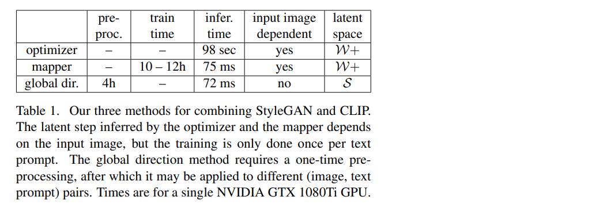
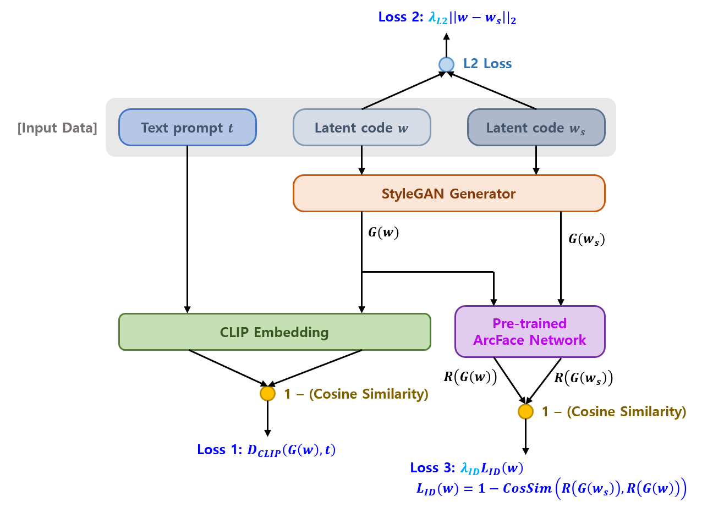

## 목차

* [1. StyleCLIP 의 핵심 아이디어 및 구성 요소](#1-styleclip-의-핵심-아이디어-및-구성-요소)
* [2. Latent Optimization](#2-latent-optimization)
* [3. Latent Mapper](#3-latent-mapper)
* [4. Global Directions](#4-global-directions)
* [5. 실험 결과](#5-실험-결과)

## 논문 소개

* Or Patashnik and Zongze Wu et al., "StyleCLIP: Text-Driven Manipulation of StyleGAN Imagery", 2021
* [arXiv Link](https://arxiv.org/pdf/2103.17249)

## 1. StyleCLIP 의 핵심 아이디어 및 구성 요소

StyleCLIP 의 핵심 아이디어는 다음과 같다.

* Source Image → **mapping** (latent code $w$) → input ($w$ + **generated residuals**) to StyleGAN

| 핵심 아이디어                                                                                              | 설명                                                                                                                     |
|------------------------------------------------------------------------------------------------------|------------------------------------------------------------------------------------------------------------------------|
| **텍스트 기반** latent optimization **(optimizer)**                                                       | CLIP 모델은 **loss network** 으로 사용됨                                                                                       |
| latent residual mapper **(mapper)**                                                                  | - 특정 text prompt 를 이용하여 학습됨 - 주어진 latent space 에 대해 'local step'을 생성                                                |
| **text prompt** 를 StyleGAN 의 style space 에 대한 **global direction** 으로 mapping **(global direction)** | 'disentanglement' ([StyleGAN 논문](https://arxiv.org/pdf/1812.04948) 개념) 뿐만 아니라, **이미지 조작 (manipulation) 의 강도** 까지 조절 가능 |

* 각 핵심 아이디어 component 별 **pre-process & 학습 & 추론 시간** 및 **latent space** 등 정보

[(출처)](https://arxiv.org/pdf/2103.17249) : Or Patashnik and Zongze Wu et al., "StyleCLIP: Text-Driven Manipulation of StyleGAN Imagery"

## 2. Latent Optimization

**Latent Optimization** 에서 CLIP 모델은 **[Loss Function](../../AI%20Basics/Deep%20Learning%20Basics/딥러닝_기초_Loss_function.md) 계산을 위한 신경망** 으로 사용된다.

* 핵심 아이디어
  * source latent code $w_s \in W+$ 에 대해, **$D_{CLIP}$ Loss + [L2 Loss](../../AI%20Basics/Deep%20Learning%20Basics/딥러닝_기초_Regularization.md#2-l1-l2-regularization) + (생성 이미지의 ArcFace 결과 간) Cosine Similarity Loss 의 합** 이 최소가 되는 $w \in W+$ 를 찾는다. 

| Loss                              | Loss 설명                                                                                                                                | 계산 대상                                    |
|-----------------------------------|----------------------------------------------------------------------------------------------------------------------------------------|------------------------------------------|
| $D_{CLIP}$ Loss                   | 계산 대상 (2개) 의 **CLIP embedding** 간의 Cosine Distance                                                                                     | generated image $G(w)$ 및 text prompt $t$ |
| L2 Loss                           |                                                                                                                                        | latent code $w$, $w_s$                   |
| Cosine Similarity Loss ($L_{ID}$) | - latent code (2개) 를 StyleGAN Generator 에 각각 입력시켜 이미지 2장 생성 - 해당 2장의 이미지를 **ArcFace Network 에 통과시킨 결과** 에 대한 Cosine Similarity Loss | $w$, $w_s$                               |

* Total Loss 수식
  * $D_{CLIP} (G(w), t) + \lambda_{L2} ||w - w_s||_2 + \lambda_{ID} L_{ID}(w)$ 
  * $L_{ID}(w) = 1 - <R(G(w_s)), R(G(w))>$

* notations

| notation                       | 설명                                          |
|--------------------------------|---------------------------------------------|
| $w$, $w_s$ ($\in W+$)          | intermediate StyleGAN latent code from $W+$ |
| $t$                            | text prompt                                 |
| $G(·)$                         | StyleGAN Generator                          |
| $\lambda_{L2}$, $\lambda_{ID}$ | 각 Loss term 에 대한 가중치                        |
| $R(·)$                         | pre-trained ArcFace Network                 |

## 3. Latent Mapper

## 4. Global Directions

## 5. 실험 결과