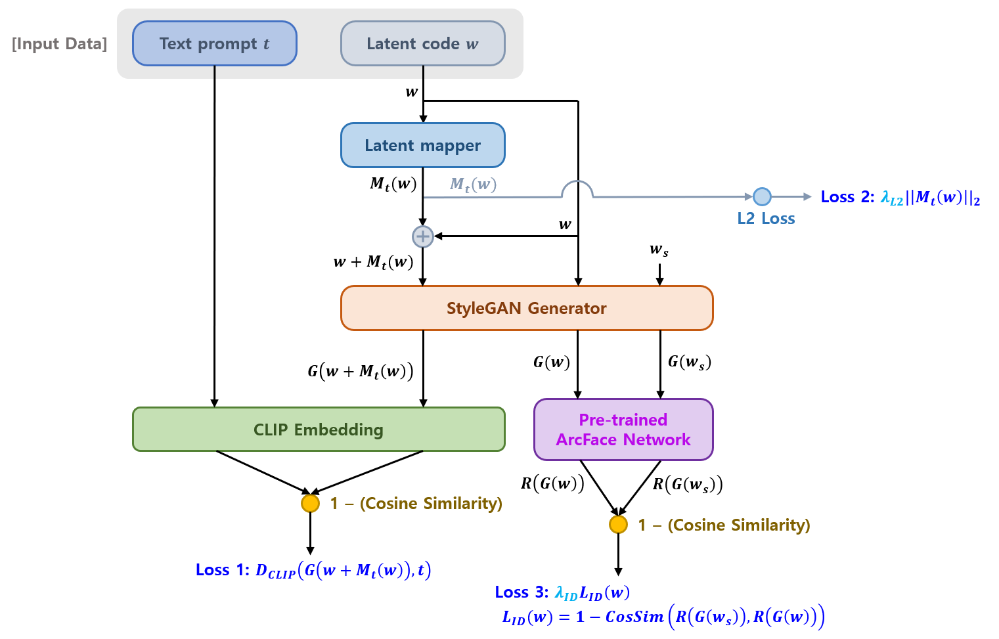
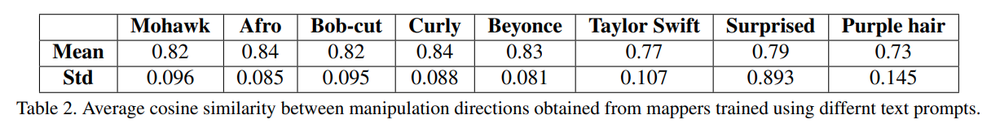

## 목차

* [1. StyleCLIP 의 핵심 아이디어 및 구성 요소](#1-styleclip-의-핵심-아이디어-및-구성-요소)
* [2. Latent Optimization](#2-latent-optimization)
* [3. Latent Mapper](#3-latent-mapper)
* [4. Global Directions](#4-global-directions)
* [5. 실험 결과](#5-실험-결과)

## 논문 소개

* Or Patashnik and Zongze Wu et al., "StyleCLIP: Text-Driven Manipulation of StyleGAN Imagery", 2021
* [arXiv Link](https://arxiv.org/pdf/2103.17249)

## 1. StyleCLIP 의 핵심 아이디어 및 구성 요소

StyleCLIP 의 핵심 아이디어는 다음과 같다.

* Source Image → **mapping** (latent code $w$) → input ($w$ + **generated residuals**) to StyleGAN

| 핵심 아이디어 (모델)                                                                                         | 설명                                                                                                                     |
|------------------------------------------------------------------------------------------------------|------------------------------------------------------------------------------------------------------------------------|
| **텍스트 기반** latent optimization **(optimizer)**                                                       | CLIP 모델은 **loss network** 으로 사용됨                                                                                       |
| latent residual mapper **(mapper)**                                                                  | - 특정 text prompt 를 이용하여 학습됨 - 주어진 latent space 에 대해 **'local step' (특정 특징만 바뀐 이미지)** 을 생성                           |
| **text prompt** 를 StyleGAN 의 style space 에 대한 **global direction** 으로 mapping **(global direction)** | 'disentanglement' ([StyleGAN 논문](https://arxiv.org/pdf/1812.04948) 개념) 뿐만 아니라, **이미지 조작 (manipulation) 의 강도** 까지 조절 가능 |

* 각 핵심 아이디어 component 별 **pre-process & 학습 & 추론 시간** 및 **latent space** 등 정보

[(출처)](https://arxiv.org/pdf/2103.17249) : Or Patashnik and Zongze Wu et al., "StyleCLIP: Text-Driven Manipulation of StyleGAN Imagery"

## 2. Latent Optimization

**Latent Optimization** 에서 CLIP 모델은 **[Loss Function](../../AI%20Basics/Deep%20Learning%20Basics/딥러닝_기초_Loss_function.md) 계산을 위한 신경망** 으로 사용된다.

* 핵심 아이디어
  * source latent code $w_s \in W+$ 에 대해, **$D_{CLIP}$ Loss + [L2 Loss](../../AI%20Basics/Deep%20Learning%20Basics/딥러닝_기초_Regularization.md#2-l1-l2-regularization) + (생성 이미지의 ArcFace 결과 간) Cosine Similarity Loss 의 합** 이 최소가 되는 $w \in W+$ 를 찾는다. 

| Loss                                 | Loss 설명                                                                                                                                                      | 계산 대상                                    |
|--------------------------------------|--------------------------------------------------------------------------------------------------------------------------------------------------------------|------------------------------------------|
| $D_{CLIP}$ Loss                      | 계산 대상 (2개) 의 **CLIP embedding** 간의 Cosine Distance                                                                                                           | generated image $G(w)$ 및 text prompt $t$ |
| L2 Loss                              |                                                                                                                                                              | latent code $w$, $w_s$                   |
| Cosine Similarity Loss ($L_{ID}$) | - latent code (2개) 를 StyleGAN Generator 에 각각 입력시켜 이미지 2장 생성 - 해당 2장의 이미지를 **ArcFace Network 에 통과시킨 결과** 에 대한 Cosine Similarity Loss **(= identity loss)** | $w$, $w_s$                               |

* Total Loss 수식
  * $D_{CLIP} (G(w), t) + \lambda_{L2} ||w - w_s||2 + \lambda_{ID} L_{ID}(w)$ 
  * $L_{ID}(w) = 1 - <R(G(w_s)), R(G(w))>$

* notations

| notation                       | 설명                                          |
|--------------------------------|---------------------------------------------|
| $w$, $w_s$ ($\in W+$)          | intermediate StyleGAN latent code from $W+$ |
| $t$                            | text prompt                                 |
| $G(·)$                         | StyleGAN Generator                          |
| $\lambda_{L2}$, $\lambda_{ID}$ | 각 Loss term 에 대한 가중치                        |
| $R(·)$                         | pre-trained ArcFace Network                 |

## 3. Latent Mapper

* 핵심 아이디어
  * 위와 같은 [Latent Optimization](#2-latent-optimization) 은 **이미지가 변하기 쉽고 (versatile), 특정 이미지를 편집하기 위한 최적화에 긴 시간이 소요** 된다는 단점이 있다.
  * 따라서, **학습된 mapping network** 를 이용하여 **text prompt $t$ 에 대해 $W+$ 에 대한 manipulation step $M_t(w)$ 을 추론** 하는 모델을 고안한다.
  * 이때, manipulation step 은 **$W+$ space** 에 대해 생성된다.

**1. Latent Mapper 의 구조**

[(출처)](https://arxiv.org/pdf/2103.17249) : Or Patashnik and Zongze Wu et al., "StyleCLIP: Text-Driven Manipulation of StyleGAN Imagery"

* latent mapper 는 다음과 같이 정의된다.
  * $M_t(w) = (M_t^c(w_c), M_t^m(w_m), M_t^f(w_f))$
  * with input image $w = (w_c, w_m, w_f)$
* 구성 요소 및 notations

| 구성 요소 (notation)                     | 설명                                                                                       |
|--------------------------------------|------------------------------------------------------------------------------------------|
| $M_t(w)$                             | latent code $w$ 에 대해, latent mapper $M_t$ 를 이용하여 도출된 **manipulation step (= residuals)** |
| $M^c, M^m, M^f$                      | $w$ → $M_t(w)$ 로의 변환을 위한 mapper - 3개의 mapper 중 **일부분만 학습도 가능**                        |
| $w_c, w_m, w_f$                      | $w$ 를 각 mapper 를 이용하여 mapping 시키기 위해 나눈 3개의 subset                                       |
| $M_t^c(w_c), M_t^m(w_m), M_t^f(w_f)$ | manipulation step $M_t(w)$ 의 구성 요소 **($w$ 의 각 subset 에 대한)**                             |

**2. Loss Function**

Latent Mapper 의 Loss Function 은 다음과 같다.

* 핵심 아이디어
  * **최종 생성 이미지** 와 **text prompt $t$** 사이의 **CLIP loss (= cosine distance) 를 최소화**
  * L2 Loss 는 [Latent Optimization](#2-latent-optimization) 에서와 달리, **$M_t(w)$ 자체에 대한** L2 Loss 로 수정
  * ArcFace Network Loss ($L_{ID}$) 는 [Latent Optimization](#2-latent-optimization) 과 동일

* 수식
  * $L(w) = L_{CLIP}(w) + \lambda_{L2} ||M_t(w)||2 + \lambda_{ID} L_{ID} (w)$

| 구성 요소                                         | 핵심 설명                                                                                                                                         | 상세 설명                                                                                                                                                                          |
|-----------------------------------------------|-----------------------------------------------------------------------------------------------------------------------------------------------|--------------------------------------------------------------------------------------------------------------------------------------------------------------------------------|
| $L_{CLIP}(w)$                                 | 최종 생성 이미지 - text prompt 간 CLIP loss (= cosine distance)                                                                                       | - $L_{CLIP}(w) = D_{CLIP}(G(w + M_t(w)), t)$ - $D_{CLIP}$ Loss 는 [Latent Optimization](#2-latent-optimization) 과 동일 - $G(w + M_t(w))$ : 최종 생성 이미지 - $t$ : text prompt |
| $\lambda_{L2} \vert\vert M_t(w) \vert\vert_2$ | $M_t(w)$ 에 대한 [L2 Loss](../../AI%20Basics/Deep%20Learning%20Basics/딥러닝_기초_Regularization.md#2-l1-l2-regularization) **(가중치: $\lambda_{L2}$)** |                                                                                                                                                                                |
| $\lambda_{ID} L_{ID} (w)$                     | ArcFace Network Loss **(가중치: $\lambda_{ID}$)**                                                                                                | - Cosine Distance (Identity Loss) - [Latent Optimization](#2-latent-optimization) 과 동일                                                                                      |

**3. 실험 결과**

* 각 속성에 대한 manipulation direction 간의 상관계수는 다음과 같다.
* [Oh-LoRA 👱‍♀️ (오로라) v3 ('25.05.26 - 06.05) 의 **StyleGAN-VectorFind-v8**](https://github.com/WannaBeSuperteur/AI_Projects/blob/main/2025_05_26_OhLoRA_v3/stylegan/stylegan_vectorfind_v8/image_generation_report.md) 및 [Oh-LoRA v3.1 ('25.06.07 - 06.13) 의 **StyleGAN-VectorFind-v9**](https://github.com/WannaBeSuperteur/AI_Projects/blob/main/2025_06_07_OhLoRA_v3_1/stylegan/stylegan_vectorfind_v9/image_generation_report.md) 보다는 **다소 낮은 편** 이다.

[(출처)](https://arxiv.org/pdf/2103.17249) : Or Patashnik and Zongze Wu et al., "StyleCLIP: Text-Driven Manipulation of StyleGAN Imagery"

## 4. Global Directions

## 5. 실험 결과