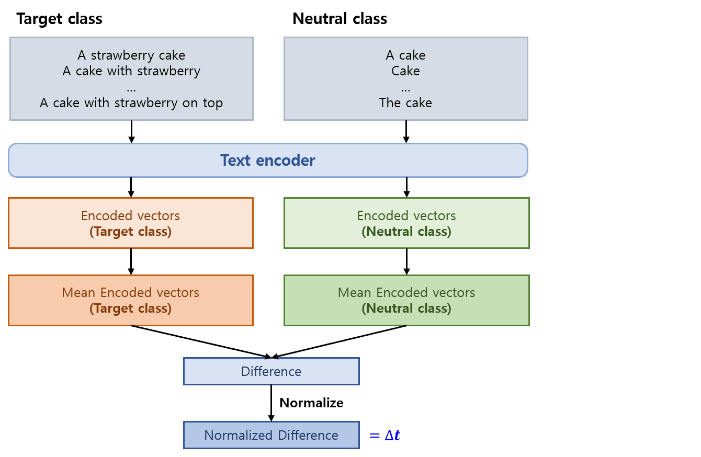
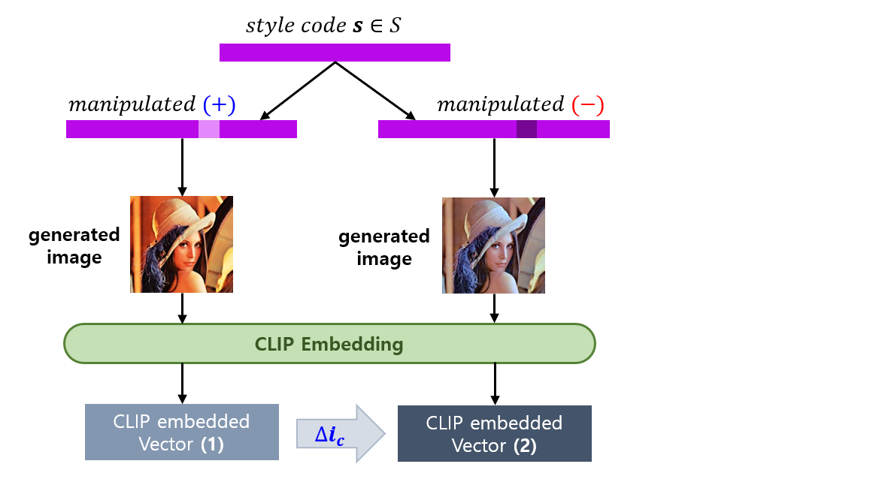
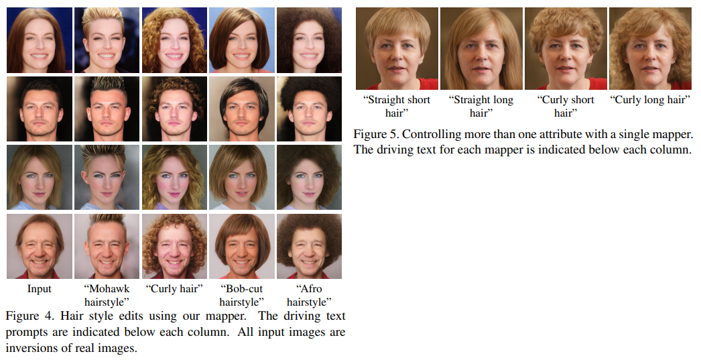
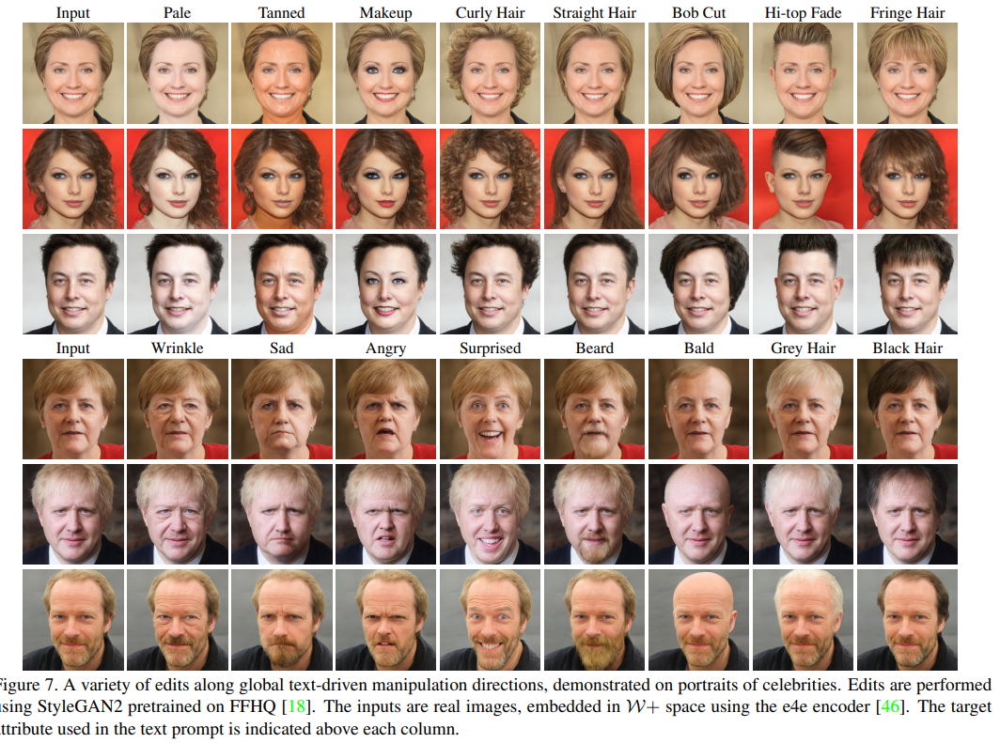

## 목차

* [1. StyleCLIP 의 핵심 아이디어 및 구성 요소](#1-styleclip-의-핵심-아이디어-및-구성-요소)
* [2. Latent Optimization](#2-latent-optimization)
* [3. Latent Mapper](#3-latent-mapper)
  * [3-1. Latent Mapper 의 구조](#3-1-latent-mapper-의-구조)
  * [3-2. Loss Function](#3-2-loss-function)
  * [3-3. Latent Mapper 실험 결과](#3-3-latent-mapper-실험-결과)
* [4. Global Directions](#4-global-directions)
* [5. 실험 결과](#5-실험-결과)

## 논문 소개

* Or Patashnik and Zongze Wu et al., "StyleCLIP: Text-Driven Manipulation of StyleGAN Imagery", 2021
* [arXiv Link](https://arxiv.org/pdf/2103.17249)

## 1. StyleCLIP 의 핵심 아이디어 및 구성 요소

StyleCLIP 의 핵심 아이디어는 다음과 같다.

* Source Image → **mapping** (latent code $w$) → input ($w$ + **generated residuals**) to StyleGAN

| 핵심 아이디어 (모델)                                                                                         | 설명                                                                                                                     |
|------------------------------------------------------------------------------------------------------|------------------------------------------------------------------------------------------------------------------------|
| **텍스트 기반** latent optimization **(optimizer)**                                                       | CLIP 모델은 **loss network** 으로 사용됨                                                                                       |
| latent residual mapper **(mapper)**                                                                  | - 특정 text prompt 를 이용하여 학습됨<br>- 주어진 latent space 에 대해 **'local step' (특정 특징만 바뀐 이미지)** 을 생성                           |
| **text prompt** 를 StyleGAN 의 style space 에 대한 **global direction** 으로 mapping **(global direction)** | 'disentanglement' ([StyleGAN 논문](https://arxiv.org/pdf/1812.04948) 개념) 뿐만 아니라, **이미지 조작 (manipulation) 의 강도** 까지 조절 가능 |

* 각 핵심 아이디어 component 별 **pre-process & 학습 & 추론 시간** 및 **latent space** 등 정보


[(출처)](https://arxiv.org/pdf/2103.17249) : Or Patashnik and Zongze Wu et al., "StyleCLIP: Text-Driven Manipulation of StyleGAN Imagery"

## 2. Latent Optimization

**Latent Optimization** 에서 CLIP 모델은 **[Loss Function](../../AI%20Basics/Deep%20Learning%20Basics/딥러닝_기초_Loss_function.md) 계산을 위한 신경망** 으로 사용된다.

* 핵심 아이디어
  * source latent code $w_s \in W+$ 에 대해, **$D_{CLIP}$ Loss + [L2 Loss](../../AI%20Basics/Deep%20Learning%20Basics/딥러닝_기초_Regularization.md#2-l1-l2-regularization) + (생성 이미지의 ArcFace 결과 간) Cosine Similarity Loss 의 합** 이 최소가 되는 $w \in W+$ 를 찾는다. 

| Loss                                 | Loss 설명                                                                                                                                                      | 계산 대상                                    |
|--------------------------------------|--------------------------------------------------------------------------------------------------------------------------------------------------------------|------------------------------------------|
| $D_{CLIP}$ Loss                      | 계산 대상 (2개) 의 **CLIP embedding** 간의 Cosine Distance                                                                                                           | generated image $G(w)$ 및 text prompt $t$ |
| L2 Loss                              |                                                                                                                                                              | latent code $w$, $w_s$                   |
| Cosine Similarity Loss<br>($L_{ID}$) | - latent code (2개) 를 StyleGAN Generator 에 각각 입력시켜 이미지 2장 생성<br>- 해당 2장의 이미지를 **ArcFace Network 에 통과시킨 결과** 에 대한 Cosine Similarity Loss **(= identity loss)** | $w$, $w_s$                               |


* Total Loss 수식
  * $D_{CLIP} (G(w), t) + \lambda_{L2} ||w - w_s||2 + \lambda_{ID} L_{ID}(w)$ 
  * $L_{ID}(w) = 1 - <R(G(w_s)), R(G(w))>$

* notations

| notation                       | 설명                                          |
|--------------------------------|---------------------------------------------|
| $w$, $w_s$ ($\in W+$)          | intermediate StyleGAN latent code from $W+$ |
| $t$                            | text prompt                                 |
| $G(·)$                         | StyleGAN Generator                          |
| $\lambda_{L2}$, $\lambda_{ID}$ | 각 Loss term 에 대한 가중치                        |
| $R(·)$                         | pre-trained ArcFace Network                 |

## 3. Latent Mapper

* 핵심 아이디어
  * 위와 같은 [Latent Optimization](#2-latent-optimization) 은 **이미지가 변하기 쉽고 (versatile), 특정 이미지를 편집하기 위한 최적화에 긴 시간이 소요** 된다는 단점이 있다.
  * 따라서, **학습된 mapping network** 를 이용하여 **text prompt $t$ 에 대해 $W+$ 에 대한 manipulation step $M_t(w)$ 을 추론** 하는 모델을 고안한다.
  * 이때, manipulation step 은 **$W+$ space** 에 대해 생성된다.

### 3-1. Latent Mapper 의 구조


[(출처)](https://arxiv.org/pdf/2103.17249) : Or Patashnik and Zongze Wu et al., "StyleCLIP: Text-Driven Manipulation of StyleGAN Imagery"

* latent mapper 는 다음과 같이 정의된다.
  * $M_t(w) = (M_t^c(w_c), M_t^m(w_m), M_t^f(w_f))$
  * with input image $w = (w_c, w_m, w_f)$
* 구성 요소 및 notations

| 구성 요소 (notation)                     | 설명                                                                                       |
|--------------------------------------|------------------------------------------------------------------------------------------|
| $M_t(w)$                             | latent code $w$ 에 대해, latent mapper $M_t$ 를 이용하여 도출된 **manipulation step (= residuals)** |
| $M^c, M^m, M^f$                      | $w$ → $M_t(w)$ 로의 변환을 위한 mapper<br>- 3개의 mapper 중 **일부분만 학습도 가능**                        |
| $w_c, w_m, w_f$                      | $w$ 를 각 mapper 를 이용하여 mapping 시키기 위해 나눈 3개의 subset                                       |
| $M_t^c(w_c), M_t^m(w_m), M_t^f(w_f)$ | manipulation step $M_t(w)$ 의 구성 요소 **($w$ 의 각 subset 에 대한)**                             |

### 3-2. Loss Function

Latent Mapper 의 Loss Function 은 다음과 같다.

* 핵심 아이디어
  * **최종 생성 이미지** 와 **text prompt $t$** 사이의 **CLIP loss (= cosine distance) 를 최소화**
  * L2 Loss 는 [Latent Optimization](#2-latent-optimization) 에서와 달리, **$M_t(w)$ 자체에 대한** L2 Loss 로 수정
  * ArcFace Network Loss ($L_{ID}$) 는 [Latent Optimization](#2-latent-optimization) 과 동일

* 수식
  * $L(w) = L_{CLIP}(w) + \lambda_{L2} ||M_t(w)||2 + \lambda_{ID} L_{ID} (w)$

| 구성 요소                                         | 핵심 설명                                                                                                                                         | 상세 설명                                                                                                                                                                          |
|-----------------------------------------------|-----------------------------------------------------------------------------------------------------------------------------------------------|--------------------------------------------------------------------------------------------------------------------------------------------------------------------------------|
| $L_{CLIP}(w)$                                 | 최종 생성 이미지 - text prompt 간 CLIP loss (= cosine distance)                                                                                       | - $L_{CLIP}(w) = D_{CLIP}(G(w + M_t(w)), t)$<br>- $D_{CLIP}$ Loss 는 [Latent Optimization](#2-latent-optimization) 과 동일<br>- $G(w + M_t(w))$ : 최종 생성 이미지<br>- $t$ : text prompt |
| $\lambda_{L2} \vert\vert M_t(w) \vert\vert_2$ | $M_t(w)$ 에 대한 [L2 Loss](../../AI%20Basics/Deep%20Learning%20Basics/딥러닝_기초_Regularization.md#2-l1-l2-regularization) **(가중치: $\lambda_{L2}$)** |                                                                                                                                                                                |
| $\lambda_{ID} L_{ID} (w)$                     | ArcFace Network Loss **(가중치: $\lambda_{ID}$)**                                                                                                | - Cosine Distance (Identity Loss)<br>- [Latent Optimization](#2-latent-optimization) 과 동일                                                                                      |


### 3-3. Latent Mapper 실험 결과

* 각 속성에 대한 manipulation direction 간의 상관계수는 다음과 같다.
* 이는 **mapper 가 이미지에 대해 적절한 manipulation step 을 추론했더라도, 이들의 방향은 서로 유사함** 을 의미한다.


[(출처)](https://arxiv.org/pdf/2103.17249) : Or Patashnik and Zongze Wu et al., "StyleCLIP: Text-Driven Manipulation of StyleGAN Imagery"

## 4. Global Directions

* 문제점
  * latent mapper 는 **추론 속도가 빠르지만, Fine-grained disentanglement 가 필요할 때는 좋지 않을 수 있다.**
  * 또한, [앞에서 확인했듯이](#3-3-latent-mapper-실험-결과) **주어진 text prompt 에 대해 서로 다른 manipulation step 의 방향이 서로 비슷하다.**
* 핵심 아이디어
  * text prompt 를 **StyleGAN 의 style space $S$ 에 대한 single global direction 으로 mapping** 하는 방법을 제안한다. 

**아이디어 상세 설명**

* 특정 속성에 대한 text prompt 와 manipulation direction $∆s$ 가 주어졌을 때, **해당 attribute 가 조작된 이미지** 는 다음과 같이 나타낼 수 있다.
  * $G(s + \alpha ∆s)$
  * $\alpha$ 는 manipulation **strength** 를 의미

* 다음과 같은 방법으로 **CLIP 의 joint language-image embedding** 인 $∆t$ 를 생성
  * 같은 의미를 갖는 여러 문장들을 text encoder 로 인코딩하고, 그 **embedding vector 의 평균** 을 계산 **(큰 수의 법칙을 이용한 noise 최소화 목적)**
  * 이 방법을 ```target class``` (예: ```a sports car```) 와 ```neutral class``` (예: ```a car```) 에 대해 각각 적용
  * 이렇게 생성된 2개의 average embedding 에 대한 **normalized difference** 계산



* target direction $∆i$ 에 대해 $∆s$ 를 계산 
  * $∆i_c$ 계산
    * Style Code $s \in S$ 에서 **오직 1개의 channel $c$ 만 조작** (값을 더하거나 뺌)
    * 그 결과로 생성되는 이미지 pair 의 **CLIP Space Direction** 을 $∆i_c$ 로 정의
  * $∆s$ 계산
    * $∆s = ∆i_c · ∆i$ if $|∆i_c · ∆i| \ge \beta$
    * $∆s = 0$ otherwise



## 5. 실험 결과

**1. [Latent Mapper](#3-latent-mapper) 를 이용한 이미지 생성 결과**



[(출처)](https://arxiv.org/pdf/2103.17249) : Or Patashnik and Zongze Wu et al., "StyleCLIP: Text-Driven Manipulation of StyleGAN Imagery"

**2. [Global Directions](#4-global-directions) 를 이용한 이미지 생성 결과**

* with **StyleGAN2** as model & **FFHQ** as dataset for pre-training



[(출처)](https://arxiv.org/pdf/2103.17249) : Or Patashnik and Zongze Wu et al., "StyleCLIP: Text-Driven Manipulation of StyleGAN Imagery"
