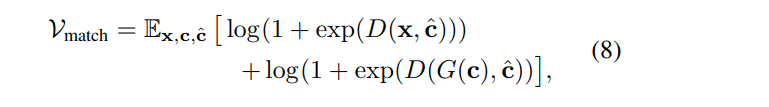

## 목차

* [1. GigaGAN 핵심 아이디어](#1-gigagan-핵심-아이디어)
* [2. GigaGAN 의 전체 구조](#2-gigagan-의-전체-구조)
* [3. Generator](#3-generator)
  * [3-1. Text and latent-code conditioning](#3-1-text-and-latent-code-conditioning)
  * [3-2. Synthesis Network (with adaptive kernel selection)](#3-2-synthesis-network-with-adaptive-kernel-selection)
* [4. Discriminator](#4-discriminator)
  * [4-1. Text conditioning & Multi-scale image processing](#4-1-text-conditioning--multi-scale-image-processing)
  * [4-2. Loss Function Overview](#4-2-loss-function-overview)
  * [4-3. Loss Term 1 (GAN Loss & Matching-aware Loss)](#4-3-loss-term-1-gan-loss--matching-aware-loss)
  * [4-4. Loss Term 2 (CLIP contrastive Loss)](#4-4-loss-term-2-clip-contrastive-loss)
  * [4-5. Loss Term 3 (Vision-aided adversarial loss)](#4-5-loss-term-3-vision-aided-adversarial-loss)
* [5. GAN-based Upsampler](#5-gan-based-upsampler)
* [6. 실험 결과](#6-실험-결과)

## 논문 소개

* Minguk Kang and Jun-Yan Zhu et al., "Scaling up GANs for Text-to-Image Synthesis", 2023
* [arXiv Link](https://arxiv.org/pdf/2303.05511)
* 개인적으로는 Figure 1 최상단의 ```a human growing colorful flowers from her hair``` 의 컨셉을 Oh-LoRA 향후 버전에 유사하게 적용해 보고 싶음

## 1. GigaGAN 핵심 아이디어

* 기존 StyleGAN 구조의 문제점
  * **StyleGAN 구조의 성능 및 학습 데이터셋 규모만을 향상시키는 것** 은 한계가 있다. (unstable)
* GigaGAN 의 특징
  * **텍스트 - 이미지 합성**
  * latent interpolation, style mixing, 벡터 연산 등 **다양한 latent space 편집 기술** 적용 가능
* GigaGAN 의 핵심 아이디어

| 핵심 아이디어              | 설명                                                                                             |
|----------------------|------------------------------------------------------------------------------------------------|
| Multi-scale Training | image-text alignment 및 low-frequency detail 향상<br>(**낮은 해상도를 나타내는 block** 의 파라미터를 효과적으로 사용 가능) |
| Multi-stage Approach | 처음에 64 x 64 이미지 생성 → 512 x 512 로 upsampling                                                    |

## 2. GigaGAN 의 전체 구조

| 구성 요소                                         | 설명                                                                                                                                                                                                                                                  |
|-----------------------------------------------|-----------------------------------------------------------------------------------------------------------------------------------------------------------------------------------------------------------------------------------------------------|
| [Generator](#3-generator)                     | - **StyleGAN2** 기반<br>- **mapping network** : input → style vector $w$, $w = M(z, t_{global})$<br>- output 생성에 사용되는 방법은 [Convolution](../../Image%20Processing/Basics_CNN.md)<br>- Synthesis Network 에 **Sample-adaptive Kernel Selection** 적용      |
| [Discrinimator](#4-discriminator)             | - **'text branch' 와 'image branch'** 의 2개의 branch 로 구성<br>- **text conditioning** : text $c$ → text description $t_D$<br>- multi-scale image processing : generator 의 'pyramid' 구조의 각 level 을 **서로 독립적으로** 처리<br>- Loss Function 은 총 3개의 term 으로 구성 |
| [GAN-based Upsampler](#5-gan-based-upsampler) | - Synthesis Network 는 **비대칭적 [U-Net](../../Image%20Processing/Model_U-Net.md) 구조** 로 64 x 64 → 512 x 512 로 upsampling                                                                                                                               |

## 3. Generator


[(출처)](https://arxiv.org/pdf/2303.05511) : Minguk Kang and Jun-Yan Zhu et al., "Scaling up GANs for Text-to-Image Synthesis"

GigaGAN 의 Generator 의 구조는 다음과 같다.

| 구성 요소                                                                                                       | 설명                                                                                                                                                                                                               |
|-------------------------------------------------------------------------------------------------------------|------------------------------------------------------------------------------------------------------------------------------------------------------------------------------------------------------------------|
| Baseline                                                                                                    | StyleGAN2 기반                                                                                                                                                                                                     |
| [Text and latent-code conditioning](#3-1-text-and-latent-code-conditioning)                                 | - **Frozen CLIP** feature extractor<br>- $T$ (additional **learned text encoder**)<br>- $M$ (MLP mapping network)                                                                                                |
| [Synthesis Network (with adaptive kernel selection)](#3-2-synthesis-network-with-adaptive-kernel-selection) | 입력:<br>- $f_l$ (feature at layer $l$)<br>- $t_{local}$ (text embedding 중 prompt 와 관련된 부분)<br>- $w$ (style vector)<br>출력: 각 layer $l$ 에 대해, $f_{l+1} = g_{xa}^l(g_{attn}^l(g_{adaconv}^l(f_l, w), w), t_{local})$ |

### 3-1. Text and latent-code conditioning


[(출처)](https://arxiv.org/pdf/2303.05511) : Minguk Kang and Jun-Yan Zhu et al., "Scaling up GANs for Text-to-Image Synthesis"

**Text and latent-code conditioning** 의 프로세스는 다음과 같다.

* 기본 프로세스
  * **StyleGAN2** 기반

* text input → text embedding $t$
  * text input 에 대한 **conditional vector** $c \in R^{C \times 768}$ 생성
  * $c$ 를 **Pre-trained CLIP text encoder** 로 forward 시켜서 $\epsilon_{txt}(c)$ 를 생성
  * $\epsilon_{txt}(c)$ 를 **Learned text encoder ($T$)** 로 forward 시켜서 text embedding $t \in R^{C \times 768}$ 를 생성

* text embedding $t$ → style vector $w$
  * $t$ 를 $t_{local} \in R^{(C - 1) \times 768}$ 과 $t_{global} \in R^{768}$ 로 분할
  * $z \sim N(0, 1)$ 을 생성
  * $t_{global}$ 과 $z$ 를 **MLP mapping network ($M$)** 으로 forward 시켜서 style vector $w = M(z, t_{global})$ 를 생성

* style vector $w$ → generated image $x$
  * $t_{local}$ 과 $w$ 를 **Synthesis Network ($\tilde{G}$)** 으로 forward 시켜서 image $x$ 를 생성
  * generated image $x = \tilde{G}(w, t_{local})$

### 3-2. Synthesis Network (with adaptive kernel selection)


[(출처)](https://arxiv.org/pdf/2303.05511) : Minguk Kang and Jun-Yan Zhu et al., "Scaling up GANs for Text-to-Image Synthesis"

**1. Generator ($\tilde{G}$) 의 구성**

| 구성 요소                                                                                                                           | 설명                                                                                                |
|---------------------------------------------------------------------------------------------------------------------------------|---------------------------------------------------------------------------------------------------|
| Convolutional block<br>($g_{adaconv}^l$)                                                                                        |                                                                                                   |
| [Self-Attention](../../Natural%20Language%20Processing/Basics_트랜스포머%20모델.md#3-1-encoder-self-attention) block<br>($g_{attn}^l$) | Convolutional Layer 가 **receptive field 기반으로 처리** 하므로 **멀리 떨어진 부분을 contextualize 하기 어렵다** 는 문제 해결 |
| Cross-Attention block<br>($g_{xa}^l$)                                                                                           | 개별 word embedding 처리 목적으로 사용                                                                      |

**2. 이미지 생성 프로세스**

* Synthesis Network 는 **upsampling convolutional layer 의 피라미드 구조** 로 되어 있음
  * 즉, feature $f_l$ 을 다음 layer 의 feature $f_{l+1}$ 으로 변환하는 **여러 개의 level** 로 구성
* 각 level 에서 다음과 같이 처리됨
  * feature $f_l$ 은 $g_{adaconv}^l$, $g_{attn}^l$, $g_{xa}^l$ 순서대로 network forward 됨
  * 이를 수식으로 나타내면 $f_{l+1} = g_{xa}^l(g_{attn}^l(g_{adaconv}^l(f_l, w), w), t_{local})$ 이 됨
* 최종적으로 다음과 같이 **피라미드 구조로 여러 이미지가 생성** 됨
  * $x_0$ (4 x 4), $x_1$ (8 x 8), $x_2$ (16 x 16), $x_3$ (32 x 32), $x_4$ (64 x 64) 

**3. Sample-adaptive kernel selection**

Sample-adaptive kernel selection 은 **학습 데이터 (인터넷상의 이미지) 의 특징이 매우 다양** 하므로, 이를 처리하기 위해 **Convolution Kernel 의 표현 능력을 "text-conditioning 기반 on-the-fly 방법"으로 향상** 시키기 위한 것이다.

* $N$ 개의 filter 를 저장하는 Filter Bank 를 초기화
  * 각 filter 는 $K_i \in R^{C_{in} \times C_{out} \times K \times K}$
* 이 Filter Bank 의 filter 들을 **weighted average** 하여 **aggregated filter** 생성
  * $K \in R^{C_{in} \times C_{out} \times K \times K}$
  * $\displaystyle K = \Sigma_{i=1}^N K_i · softmax(W_{filter}^T w + b_{filter})_i$
  * 해당 필터는 **StyleGAN2의 convolution pipeline** 에 사용
* 최종 modulated weights $g_{adaconv}(f, w)$ 생성
  * $g_{adaconv}(f, w) = ((W_{mod}^T w + b_{mod}) ⊗ K) * f$
  * **Convolutional block 의 최종 출력값** 에 해당

| ⊗               | *           |
|-----------------|-------------|
| (de-)modulation | convolution |

## 4. Discriminator


[(출처)](https://arxiv.org/pdf/2303.05511) : Minguk Kang and Jun-Yan Zhu et al., "Scaling up GANs for Text-to-Image Synthesis"

**GigaGAN Discriminator** 는 다음과 같은 프로세스로 구성된다.

| 프로세스                         | 설명                                                                    |
|------------------------------|-----------------------------------------------------------------------|
| Text Conditioning            | text $c$ → text descriptor $t_D$                                      |
| Multi-scale image processing | 여러 scale 의 feature vector 를 추출 (resoution: ```32 → 16 → 8 → 4 → 1```) |

**GigaGAN 의 Loss Function** 은 다음과 같이 구성된다.

* Matching-aware Loss
* CLIP contrastive Loss
* Vision-aided adversarial Loss

### 4-1. Text conditioning & Multi-scale image processing

**1. Text Conditioning**

* 원본 텍스트 $c$ 를 **text descriptor $t_D$** 로 mapping 시킨다.
  * 이때, **CLIP 과 같은 text encoder + trainable attention layer** 를 이용한다.

**2. Multi-scale image processing**

* 위 그림과 같은 **피라미드 구조** 에서, 각 resolution level 을 **서로 독립적으로 처리** 한다.
* 총 5개의 feature extractor $\phi_{i→j} : R^{X_i \times X_i \times 3} → R^{X_j^D \times X_j^D \times C_j}$ 를 정의한다.
  * 각 feature extractor 는 **Convolutional Layer + Self-Attention Layer** 로 구성된다.
  * 각 feature extractor 의 output 의 resolution 은 **32 → 16 → 8 → 4 → 1** 순으로, 최종 출력 결과물의 차원은 $R^{1 \times 1 \times C_5}$ 이다.

### 4-2. Loss Function Overview

**GigaGAN 의 [Loss Function](../../AI%20Basics/Deep%20Learning%20Basics/딥러닝_기초_Loss_function.md)** 은 다음과 같이 구성되며, **전체 Loss 는 이들의 합** 으로 정의된다.

* GigaGAN **Total Loss** : $V(G, D) = V_{MS-I/O}(G, D) + L_{CLIP}(G) + L_{Vision}(G)$
* Gen = Generator, Dis = Discriminator

| Loss Term                                                                                      | 적용 모델                      | 설명                                                                                                                                                                                                                              |
|------------------------------------------------------------------------------------------------|----------------------------|---------------------------------------------------------------------------------------------------------------------------------------------------------------------------------------------------------------------------------|
| [GAN Loss & Matching-aware Loss](#4-3-loss-term-1-gan-loss--matching-aware-loss), $V_{MS-I/O}$ | Gen, Dis                   | - **GAN Loss** : [원래 표준 GAN 의 Loss Function](../../Generative%20AI/Basics_GAN.md#2-gan의-구조-및-작동-원리)<br>- **Matching-aware Loss** : Discriminator 가 '조건'을 잘 반영하도록 하기 위해, **랜덤하게 생성된 condition $\hat{c}$ 를 이용** 하여 fake pair 를 생성 |
| [CLIP contrastive Loss](#4-4-loss-term-2-clip-contrastive-loss), $L_{CLIP}$                    | Gen                        | **Pre-trained CLIP encoder** 를 이용한 **contrastive loss**                                                                                                                                                                         |
| [Vision-aided adversarial loss](#4-5-loss-term-3-vision-aided-adversarial-loss), $L_{vision}$  | Gen **(+ Additional Dis)** | **Vision-Aided GAN** 의 Discriminator (CLIP 모델 사용) 를 추가로 사용                                                                                                                                                                      |

### 4-3. Loss Term 1 (GAN Loss & Matching-aware Loss)

**1. $V_{MS-I/O}$ Loss Term: Multi-scale input, multi-scale output adversarial loss**

* $V_{MS-I/O}$ Loss Term 은 다음과 같이 **[GAN Loss](../../Generative%20AI/Basics_GAN.md#2-gan의-구조-및-작동-원리) ($V_{GAN}$) + Matching-aware Loss ($V_{match}$)** 의 합을 의미한다.


[(출처)](https://arxiv.org/pdf/2303.05511) : Minguk Kang and Jun-Yan Zhu et al., "Scaling up GANs for Text-to-Image Synthesis"

| notation            | 설명                                         |
|---------------------|--------------------------------------------|
| $\psi_j$            | 4-layer 1 $\times$ 1 modulated Convolution |
| $\phi_{i→j}$        | Discriminator 의 Feature Extractor          |
| $Conv_{1 \times 1}$ | skip connection 으로 추가된 부분                  |

**2. Matching-aware Loss ($V_{match}$)**

기존 **GAN Loss** 외에, **Matching-aware Loss** 는 다음과 같은 역할을 한다.

* **랜덤하게 생성된 condition $\hat{c}$** 을 이용하여 fake pair 를 생성
* 해당 fake pair 를 학습함으로써 **Discriminator 가 '조건'을 더 잘 반영할 수 있음**

Matching-aware Loss 는 [기존 GAN Loss](../../Generative%20AI/Basics_GAN.md#2-gan의-구조-및-작동-원리) 와 유사한 점이 있다.



[(출처)](https://arxiv.org/pdf/2303.05511) : Minguk Kang and Jun-Yan Zhu et al., "Scaling up GANs for Text-to-Image Synthesis"

### 4-4. Loss Term 2 (CLIP contrastive Loss)

**CLIP contrastive Loss** 는 **Pre-trained CLIP image & text encoder** 를 이용하여 임베딩한 결과물에 대한 **Contrastive [Cross-Entropy Loss](../../AI%20Basics/Deep%20Learning%20Basics/딥러닝_기초_Loss_function.md#2-5-categorical-cross-entropy-loss)** 이다.

* Contrastive Learning 이란 **가까이 위치하도록 하는 것은 feature space 상에서 거리를 가깝게, 멀리 위치하도록 하는 것은 feature space 상에서 거리를 멀게** 하도록 학습시키는 것이다.
  * 즉, [S-BERT (Sentence BERT)](../../Natural%20Language%20Processing/Basics_BERT,%20SBERT%20모델.md#sbert-모델) 의 학습 방법과 컨셉이 일정 부분 유사하다.


[(출처)](https://arxiv.org/pdf/2303.05511) : Minguk Kang and Jun-Yan Zhu et al., "Scaling up GANs for Text-to-Image Synthesis"

| notation             | 설명                                  |
|----------------------|-------------------------------------|
| $\eta_{img}$         | CLIP image encoder                  |
| $\eta_{txt}$         | CLIP text encoder                   |
| $c_0, c_1, ..., c_n$ | training data 에서 sampling 된 caption |

### 4-5. Loss Term 3 (Vision-aided adversarial loss)

**Vision-aided adversarial loss ( $L_{Vision}(G)$ )** 의 아이디어는 다음과 같다.

* **Vision-Aided GAN 의 Discriminator (CLIP 모델 사용)** 를 추가 Discriminator 로 사용
  * 해당 Discriminator 의 **CLIP image encoder 를 freeze** 한 후, intermediate layer 로부터 feature extraction 실시
  * 해당 feature extraction 에 대해 **real/fake 판정** 실시
* 학습 안정화를 위해서, **Projected GAN** 이라는 random projection layer 를 추가

## 5. GAN-based Upsampler

**GAN-based Upsampler** 의 Synthesis Network 의 구성은 다음과 같다.

* **비대칭적 [U-Net](../../Image%20Processing/Model_U-Net.md) 구조**
* 최종적으로, 이미지를 64 x 64 → 512 x 512 로 upsampling

| 구조                    | 설명                                                               |
|-----------------------|------------------------------------------------------------------|
| **downsampling** part | 3 개의 downsampling residual block 으로 구성                           |
| **upsampling** part   | 6 개의 upsampling residual block **(with attention layers)** 으로 구성 |

## 6. 실험 결과