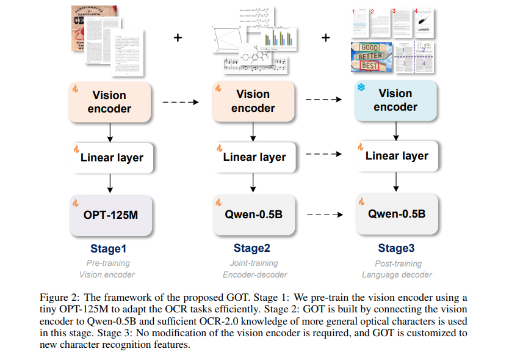

## 목차

* [1. Traditional vs. LVLM-driven OCR](#1-traditional-vs-lvlm-driven-ocr)
  * [1-1. 전통적인 OCR 방법](#1-1-전통적인-ocr-방법)
  * [1-2. LVLM-driven OCR 방법](#1-2-lvlm-driven-ocr-방법)
* [2. General OCR Theory 프레임워크의 핵심 아이디어](#2-general-ocr-theory-프레임워크의-핵심-아이디어)
  * [2-1. 상세 학습 과정](#2-1-상세-학습-과정) 
* [3. General OCR Theory 상세 - Vision Encoder 사전학습](#3-general-ocr-theory-상세---vision-encoder-사전학습)
* [4. General OCR Theory 상세 - Multi-task Joint Training을 통한 OCR-2.0의 지식 스케일업](#4-general-ocr-theory-상세---multi-task-joint-training을-통한-ocr-20의-지식-스케일업)
  * [4-1. Joint-training을 위한 데이터 엔진](#4-1-joint-training을-위한-데이터-엔진)
  * [4-2. Decoder Post-training을 통한 OCR feature 커스터마이징](#4-2-decoder-post-training을-통한-ocr-feature-커스터마이징)
* [5. 실험 결과](#5-실험-결과)
  * [5-1. 실험 설정 상세](#5-1-실험-설정-상세)
  * [5-2. Plain/Formatted Document 에서의 OCR 성능](#5-2-plainformatted-document-에서의-ocr-성능)
  * [5-3. Scene Text 에서의 OCR 성능](#5-3-scene-text-에서의-ocr-성능)
  * [5-4. Fine-grained OCR 성능](#5-4-fine-grained-ocr-성능)
  * [5-5. 보다 다양한 OCR 성능](#5-5-보다-다양한-ocr-성능)

## 논문 소개

* Haoran Wei and Chenglong Liu et al., "General OCR Theory: Towards OCR-2.0 via a Unified End-to-end Model", 2024
* [arXiv Link](https://arxiv.org/pdf/2409.01704)

## 1. Traditional vs. LVLM-driven OCR

기존의 전통적인 OCR 방법과 LVLM (Large Vision-Language Model) 에 의한 OCR 방법의 핵심 차이점은 다음과 같다.

|       | 기존 OCR 방법                                                                     | LVLM 기반 OCR 방법                                                                                            |
|-------|-------------------------------------------------------------------------------|-----------------------------------------------------------------------------------------------------------|
| 이름    | OCR-1.0                                                                       | OCR-2.0                                                                                                   |
| 핵심 모듈 | 여러 개의 전문가 모듈                                                                  | frozen CLIP Encoder                                                                                       |
| 문제점   | - 여러 개의 전문가 모듈로 인한 시스템 오류, 높은 유지 비용 등 - **특정 sub-task 에 최적화** 되어 일반화 성능 부족 | - vanilla CLIP 모델이 **out-of-domain OCR task** 에서의 OCR 성능 bottleneck 으로 작용 - frozen LLM 사용 시, 문자 압축률 낮음 |
| 해결 방법 |                                                                               | - (문자 압축률 문제 해결 방법) **sliding window** 방법으로 입력 이미지를 작은 patch 로 분해                                         |

### 1-1. 전통적인 OCR 방법

기존의 전통적인 OCR 방법은 **OCR-1.0** 이라고 하며, 다음과 같은 특징이 있다.

* 여러 개의 **expert module (전문가 모듈)** 로 구성
  * 전문가 모듈에는 layout analysis, text detection, region extraction 등을 독립적으로 수행하는 각각의 모듈 존재
  * 이와 같이 여러 개의 모듈을 사용하는 이유는 **텍스트 인식 모듈 단독으로는 인식에 실패하는 경우가 많기** 때문
  * 한편, 이와 같이 여러 개의 모듈로 구성된 복잡한 프로세스는 **시스템 오류가 있고, 유지 비용이 높을 수 있음**
* **특정한 sub-task에 최적화** 된 구성
  * 즉, **일반화 성능 (general ability)** 이 부족함 

### 1-2. LVLM-driven OCR 방법

**LVLM (Large Vision-Language Model)** 기반의 OCR 방법은 **OCR-2.0** 이라고 하며, 다음과 같은 특징이 있다.

* 인식 및 추론 관련 **종합적 역량** 을 보유하고 있음
* 대부분의 LVLM 은 **frozen CLIP Encoder 모델** 이 OCR 성능의 핵심 요인
  * 이러한 모델에서 **out-of-domain task** 에 대한 OCR 성능의 bottleneck 은 보통 **vanilla CLIP 모델** 임
  * 일부 LVLM 에서는 **encoder 를 학습 가능하게 하고 LLM 을 freeze 시키는** 형태로 구성
    * 이를 통해 CLIP encoder 의 성능을 향상시킴
* frozen LLM 사용 시, 문제점 및 해결 방법

| 구분    | 설명                                                                                                                        |
|-------|---------------------------------------------------------------------------------------------------------------------------|
| 문제점   | 문자 압축률이 낮음 (low optical character compression rate) - 이는 frozen LLM 이 **image token 으로부터 많은 양의 텍스트를 decode 하기 어렵기** 때문 |
| 해결 방법 | **sliding window** 를 이용하여 입력 이미지를 **작은 patch 로 분해**                                                                       |

## 2. General OCR Theory 프레임워크의 핵심 아이디어

**General OCR Theory (GOT)** 프레임워크는 다음과 같이 **image encoder, linear layer, output decoder 의 3가지 모듈** 로 구성되어 있다.

| 모듈                                  | 설명                                                                        |
|-------------------------------------|---------------------------------------------------------------------------|
| image encoder (= Vision Encoder)    | 본 논문에서는 **VitDet** 을 사용                                                   |
| linear layer                        | **Vision Encoder** 와 **Language Decoder** 사이의 channel dimension 을 mapping |
| output decoder (= Language Decoder) | 언어 모델                                                                     |

[(출처)](https://arxiv.org/pdf/2409.01704) : Haoran Wei and Chenglong Liu et al., "General OCR Theory: Towards OCR-2.0 via a Unified End-to-end Model"

### 2-1. 상세 학습 과정

**General OCR Theory (GOT)** 프레임워크의 상세 학습 과정은 다음과 같다.

| 단계                             | 설명                                                                                                                                                                                                               |
|--------------------------------|------------------------------------------------------------------------------------------------------------------------------------------------------------------------------------------------------------------|
| Pre-training Vision Encoder    | **순수한 텍스트 인식 task** 에 대해 Vision Encoder 를 Pre-training - 이때, **효율적인 학습** 을 위해 encoder 로 gradient 를 전달하기 위한 **아주 작은 decoder** 를 사용 - 이때, Vision Encoder 가 문자 인코딩을 하는 능력을 얻게 하기 위해 **텍스트와 문자를 포함한 이미지** 로 학습 |
| Joint-training Encoder-Decoder | 학습된 Vision Encoder 와 새로 만들어진 큰 Decoder 를 연결하여 **GOT 구조 완성** - 이때 **더 다양한 종류의** OCR 학습 데이터를 사용                                                                                                                 |
| Post-training Language Decoder | GOT 모델의 **일반화 성능 향상** - Fine-grained & Multi-crop/page synthetic data 등을 학습 데이터로 추가 - region prompt OCR 등 다양한 케이스 대응                                                                                       |

## 3. General OCR Theory 상세 - Vision Encoder 사전학습

여기서는 **OCR 전용 Vision Encoder를 사전학습** 하는 것에 대해 다룬다.

* **General OCR Theory** 에서는 Vision Encoder 구조로 **VitDet 의 80M param version** 을 사용한다.
  * 그 이유는 **local attention 을 통해 고해상도 이미지에 대한 계산량을 줄일** 수 있기 때문이다.
  * Encoder의 마지막 2개 레이어에 대해서는 다음과 같은 **Vary-tiny Setting** 구조를 적용한다.

* 학습 데이터 구성

## 4. General OCR Theory 상세 - Multi-task Joint Training을 통한 OCR-2.0의 지식 스케일업

### 4-1. Joint-training을 위한 데이터 엔진

### 4-2. Decoder Post-training을 통한 OCR feature 커스터마이징

## 5. 실험 결과

### 5-1. 실험 설정 상세

### 5-2. Plain/Formatted Document 에서의 OCR 성능

### 5-3. Scene Text 에서의 OCR 성능

### 5-4. Fine-grained OCR 성능

### 5-5. 보다 다양한 OCR 성능
