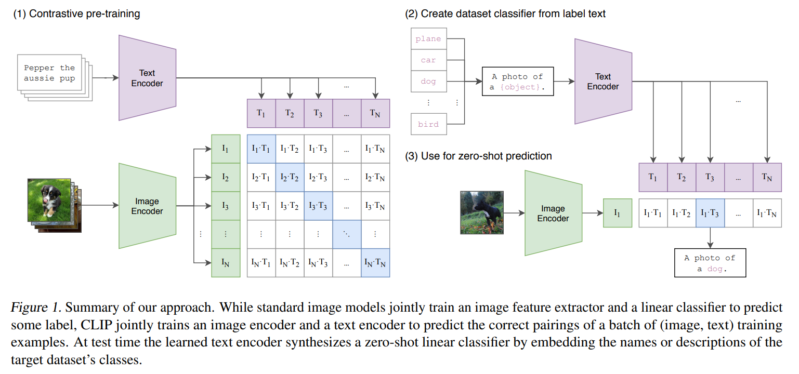

## 목차

* [1. CLIPArTT의 핵심 아이디어](#1-clipartt의-핵심-아이디어)
  * [1-1. 기존 CLIP 방법 및 그 문제점](#1-1-기존-clip-방법-및-그-문제점)
* [2. CLIPArTT의 구조](#2-clipartt의-구조)
  * [2-1. Image-Text Similarity 를 이용한 예측](#2-1-image-text-similarity-를-이용한-예측)
  * [2-2. top-K 클래스 예측을 이용한 텍스트 프롬프트 생성](#2-2-top-k-클래스-예측을-이용한-텍스트-프롬프트-생성)
  * [2-3. 최종 Loss 계산](#2-3-최종-loss-계산)
* [3. 기존 기술과의 관련성](#3-기존-기술과의-관련성)
  * [3-1. 관련 기술](#3-1-관련-기술)
  * [3-2. TTA Loss 를 Laplacian Regularization 으로 표현](#3-2-tta-loss-를-laplacian-regularization-으로-표현)
* [4. 실험 설정 및 결과](#4-실험-설정-및-결과)
  * [4-1. 실험 설정](#4-1-실험-설정)
  * [4-2. 기본 실험 결과](#4-2-기본-실험-결과)
  * [4-3. 서로 다른 데이터셋에서의 실험 결과](#4-3-서로-다른-데이터셋에서의-실험-결과)
  * [4-4. CLIPArTT의 한계점 분석](#4-4-clipartt의-한계점-분석)

## 논문 소개

* Gustavo A. Vargas Hakim and David Osowiechi et al., "CLIPArTT: Adaption of CLIP to New Domains at Test Time", 2024
* [Arxiv Link](https://arxiv.org/pdf/2405.00754)

## 1. CLIPArTT의 핵심 아이디어

* **CLIPArTT** 는 **CLIP (Contrastive Language-Image Pre-Training)** [(GitHub)](https://github.com/openai/CLIP) [(Paper)](https://arxiv.org/pdf/2103.00020) 에 **Test-Time Adaption** 을 추가 적용한 방법이다.
  * **Normalization Layer 의 파라미터** 를 업데이트하여 VLM을 최적화시킨다.
* **다중 클래스 → 단일 text prompt 로의 변환** 을 통해 구현한다.
  * 해당 text prompt 는 **pseudo-label** 로 사용된다.

### 1-1. 기존 CLIP 방법 및 그 문제점

* **1. 기존 CLIP 방법**

[(출처)](https://arxiv.org/pdf/2103.00020) : Alec Radford and Jong Wook Kim et al., "Learning Transferable Visual Models From Natural Language Supervision" 

----

> 1. Contrasive Pre-training

* N장의 이미지를 **image encoder** 에 입력시켜, 그 **출력값 (feature vector)** 을 얻는다.
* 마찬가지로 N개의 텍스트를 **text encoder** 에 입력시켜, 그 출력값 (feature vector) 을 얻는다.
* 이 출력 feature vector 들에 대해 **Contrasive Learning** 실시
  * 위 이미지의 $N \times N$ 행렬의 blue cell (correct) 에 해당하는 cosine similarity 는 최대화한다.
  * white cell (incorrect) 에 해당하는 consine simiilarity 는 최소화한다.

> 2. Test (Prediction) Time

* 각 텍스트를 Text Encoder 에 입력하여 { $T_1$, $T_2$, ..., $T_N$} 을 얻는다.
* 이미지 (with index = k) 를 Image Encoder 에 입력하여 $I_k$ 를 얻는다.
* $I_k · T_1$, $I_k · T_2$, ..., $I_k · T_N$ 중 최댓값으로 해당 이미지의 text class 를 예측한다.

----

* **2. 기존 CLIP 방법의 문제점**

## 2. CLIPArTT의 구조

### 2-1. Image-Text Similarity 를 이용한 예측

### 2-2. top-K 클래스 예측을 이용한 텍스트 프롬프트 생성

### 2-3. 최종 Loss 계산

## 3. 기존 기술과의 관련성

### 3-1. 관련 기술

### 3-2. TTA Loss 를 Laplacian Regularization 으로 표현

## 4. 실험 설정 및 결과

### 4-1. 실험 설정

### 4-2. 기본 실험 결과

### 4-3. 서로 다른 데이터셋에서의 실험 결과

### 4-4. CLIPArTT의 한계점 분석
