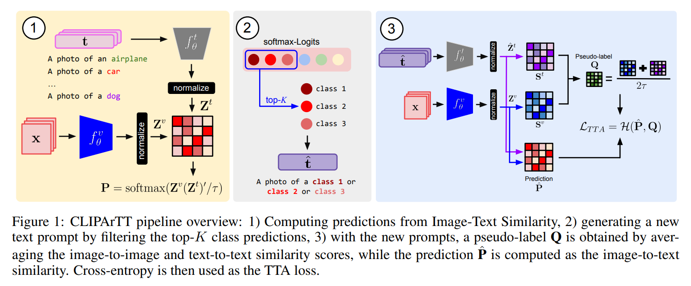
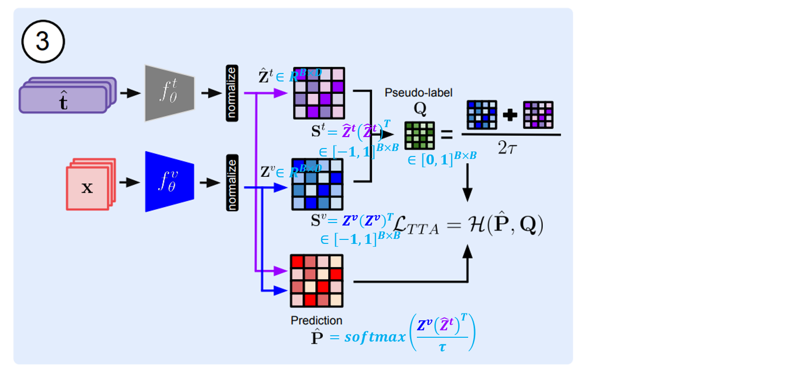

## 목차

* [1. CLIPArTT의 핵심 아이디어](#1-clipartt의-핵심-아이디어)
  * [1-1. 기존 CLIP 방법 및 그 문제점](#1-1-기존-clip-방법-및-그-문제점)
  * [1-2. CLIP 방법의 문제점에 대한 Key Insight](#1-2-clip-방법의-문제점에-대한-key-insight)
* [2. CLIPArTT의 구조](#2-clipartt의-구조)
  * [2-1. Image-Text Similarity 를 이용한 예측](#2-1-image-text-similarity-를-이용한-예측)
  * [2-2. top-K 클래스 예측을 이용한 텍스트 프롬프트 생성](#2-2-top-k-클래스-예측을-이용한-텍스트-프롬프트-생성)
  * [2-3. 최종 Loss (= TTA) 계산](#2-3-최종-loss--tta-계산)
* [3. 기존 기술과의 관련성](#3-기존-기술과의-관련성)
  * [3-1. 관련 기술](#3-1-관련-기술)
  * [3-2. TTA Loss 를 Laplacian Regularization 으로 표현](#3-2-tta-loss-를-laplacian-regularization-으로-표현)
* [4. 실험 설정 및 결과](#4-실험-설정-및-결과)
  * [4-1. 실험 설정](#4-1-실험-설정)
  * [4-2. 기본 실험 결과](#4-2-기본-실험-결과)
  * [4-3. 서로 다른 데이터셋에서의 실험 결과](#4-3-서로-다른-데이터셋에서의-실험-결과)
  * [4-4. CLIPArTT의 한계점 분석](#4-4-clipartt의-한계점-분석)

## 논문 소개

* Gustavo A. Vargas Hakim and David Osowiechi et al., "CLIPArTT: Adaption of CLIP to New Domains at Test Time", 2024
* [Arxiv Link](https://arxiv.org/pdf/2405.00754)

## 1. CLIPArTT의 핵심 아이디어

* **CLIPArTT** 는 **CLIP (Contrastive Language-Image Pre-Training)** [(GitHub)](https://github.com/openai/CLIP) [(Paper)](https://arxiv.org/pdf/2103.00020) 에 **Test-Time Adaption** 을 추가 적용한 방법이다.
  * **Normalization Layer 의 파라미터** 를 업데이트하여 VLM을 최적화시킨다.
* **다중 클래스 → 단일 text prompt 로의 변환** 을 통해 구현한다.
  * 해당 text prompt 는 **pseudo-label** 로 사용된다.

### 1-1. 기존 CLIP 방법 및 그 문제점

* **1. 기존 CLIP 방법**


[(출처)](https://arxiv.org/pdf/2103.00020) : Alec Radford and Jong Wook Kim et al., "Learning Transferable Visual Models From Natural Language Supervision" 

----

> 1. Contrasive Pre-training

* N장의 이미지를 **image encoder** 에 입력시켜, 그 **출력값 (feature vector)** 을 얻는다.
* 마찬가지로 N개의 텍스트를 **text encoder** 에 입력시켜, 그 출력값 (feature vector) 을 얻는다.
* 이 출력 feature vector 들에 대해 **Contrasive Learning** 실시
  * 위 이미지의 $N \times N$ 행렬의 blue cell (correct) 에 해당하는 cosine similarity 는 최대화한다.
  * white cell (incorrect) 에 해당하는 consine simiilarity 는 최소화한다.

> 2. Test (Prediction) Time

* 각 텍스트를 Text Encoder 에 입력하여 { $T_1$, $T_2$, ..., $T_N$} 을 얻는다.
* 이미지 (with index = k) 를 Image Encoder 에 입력하여 $I_k$ 를 얻는다.
* $I_k · T_1$, $I_k · T_2$, ..., $I_k · T_N$ 중 최댓값으로 해당 이미지의 text class 를 예측한다.

----

* **2. 기존 CLIP 방법의 문제점**

기존 CLIP 방법의 문제점은 다음과 같다.

| 문제점               | 설명                                                                                                                                        |
|-------------------|-------------------------------------------------------------------------------------------------------------------------------------------|
| Domain Shift 문제   | Domain Shift 로 인해 **모델의 예측 신뢰성이 떨어진다.**<br>- 예를 들어, 잘못된 class에 대한 예측 확률이 높다.<br>- Entropy Minimization 과 같은 기술을 통해서도 이러한 예측 오류를 해결하기 어렵다. |
| Test batch sample | test batch 에 있는 sample 들은 **서로 독립적** 이다.<br>- 또한 이들 간의 semantic relationship 을 이용하지 못한다.                                                  |

### 1-2. CLIP 방법의 문제점에 대한 Key Insight

* CLIP 방법이 가지고 있는 위 문제점에 대한 핵심적인 insight 는 다음과 같다.

| 인사이트                                                             | 설명                                                                                                                                                       |
|------------------------------------------------------------------|----------------------------------------------------------------------------------------------------------------------------------------------------------|
| correct class 는 **가장 가능성이 높은 class 중 하나** 인 경우가 많다.              | - conformal learning (95% 등 1에 가까운 확률의 prediction region 생성) 관련 인사이트임<br>- **여러 개의 class에 대한 정보** 를 포함하는 방법은 **Test Time 에 model adaption 을 적용** 하는 것이다. |
| batch sample 간 유사성은 **visual, text embedding 을 이용하여 측정** 될 수 있다. | - 이러한 유사성은 **Stochastic Neighbor Embedding (SNE)** 등의 전략으로도 확인할 수 있다.                                                                                    |

## 2. CLIPArTT의 구조

* CLIPArTT의 전체 구조는 다음과 같다.



[(출처)](https://arxiv.org/pdf/2405.00754) : Gustavo A. Vargas Hakim and David Osowiechi et al., "CLIPArTT: Adaption of CLIP to New Domains at Test Time", 2024

* CLIPArTT 구조 요약

| 세부 구조                          | 설명                                                                                     |
|--------------------------------|----------------------------------------------------------------------------------------|
| Image-Text Similarity 를 이용한 예측 | 기존 CLIP 알고리즘 기반                                                                        |
| top-K 클래스 예측을 이용한 텍스트 프롬프트 생성  | top-k 예측으로부터 **Instance-specific 한 prompt 를 생성**                                       |
| 최종 Loss 계산                     | **Test-Time Adaption (TTA) Loss** 를 이용하여 **batch sample 간 semantic relationship 을 처리** |

### 2-1. Image-Text Similarity 를 이용한 예측

CLIPArTT 에서는 기본적으로 CLIP 처럼 **Image-Text Similarity** 를 이용하여 class 를 예측한다.

* 어떤 텍스트 $t_k$ 와 새로운 이미지 $x_i$ 에 대해, 그 이미지가 class $k$ 에 속할 확률 $p_{ik}$ 는 다음과 같다.

| 구분    | 설명                                                                                                                                                                                                                                                                                                             |
|-------|----------------------------------------------------------------------------------------------------------------------------------------------------------------------------------------------------------------------------------------------------------------------------------------------------------------|
| 핵심 컨셉 | - 이미지의 embedding vector 와 텍스트의 embedding vector 간의,<br>- [Cosine Similarity](../../AI%20Basics/Data%20Science%20Basics/데이터_사이언스_기초_Cosine_similarity.md) 값에 대한,<br>- [Temperature 를 이용한 Softmax (= soft label)](../../AI%20Basics/Deep%20Learning%20Basics/딥러닝_기초_Knowledge_Distillation.md#4-1-soft-label) 컨셉 |
| 수식    | $\displaystyle p_{ik} = \frac{\exp(\cos(z_i^v, z_k^t) / \tau)}{\Sigma_j \exp(\cos(z_i^v, z_j^t) / \tau)}$                                                                                                                                                                                                      |

* notation 설명

| notation | 설명                                           |
|----------|----------------------------------------------|
| $z^v$    | $z^v \in R^D$ 로, 이미지 $x$ 에 대한 visual feature |
| $z^t$    | $z^t \in R^D$ 로, 텍스트 프롬프트 $t$ 에 대한 feature   |
| $\tau$   | softmax temperature                          |

### 2-2. top-K 클래스 예측을 이용한 텍스트 프롬프트 생성

CLIPArTT 에서는 다음과 같이 **top-k 예측 결과를 이용한 instance-specific prompt** 를 생성한다.

* 먼저, CLIP 기반으로 각 class의 확률을 계산한다.
* 이 계산한 확률을 바탕으로 **top k 개의 class와 관련된 프롬프트** 를 생성한다.
* 예시
  * ```a photo of a {class 1} or ... or {class k}```

### 2-3. 최종 Loss (= TTA) 계산

**Transductive TTA (= Test-Time Adaption) Loss** 는 **각 batch sample 간의 semantic relationship 을 처리** 하기 위한 Loss Function 이다.



[(출처)](https://arxiv.org/pdf/2405.00754) : Gustavo A. Vargas Hakim and David Osowiechi et al., "CLIPArTT: Adaption of CLIP to New Domains at Test Time", 2024

* TTA Loss 의 기본 컨셉 및 수식

| 구분    | 설명                                                                                                     |
|-------|--------------------------------------------------------------------------------------------------------|
| 기본 컨셉 | **text, image embedding** 에 대한 Prediction 과 Pseudo-Label 간의 **Cross-Entropy**                          |
| 수식    | $\displaystyle L_{TTA}(\theta) = - \frac{1}{B} \Sigma_{i=1}^B \Sigma_{j=1}^B q_{ij} \log \hat{p}_{ij}$ |

* TTA Loss 의 계산 순서

| 계산 순서                                          | 설명                                                                                                                                                       |
|------------------------------------------------|----------------------------------------------------------------------------------------------------------------------------------------------------------|
| 정규화된 visual, text embedding                    | - $Z^v \in R^{B \times D}$ : **visual** embedding<br>- $\hat{Z}^t \in R^{B \times D}$ : **text** embedding                                               |
| **image-to-image** similarity matrix           | $S^v = Z^v(Z^v)^T \in [-1, 1]^{B \times B}$                                                                                                              |
| **text-to-text** similarity matrix             | $S^t = \hat{Z}^t (\hat{Z}^t)^T \in [-1, 1]^{B \times B}$                                                                                                 |
| Pseudo-Label 생성을 위한 pairwise similarity matrix | $Q = softmax((S^v + S^t)/2 \tau) \in [0,1]^{B \times B}$<br>- 여기서 softmax 연산은 **column-wise 하게 적용** 하며, temperature $\tau$ 의 값은 이 실험에서는 **0.01** 로 고정    |
| Zero-shot prediction matrix                    | $\hat{P} = softmax(Z^v(\hat{Z}^t)^T / \tau)$<br>- instance-specific 한 multi-class 텍스트 프롬프트 사용<br>- $\hat{P}$ 의 각 성분 $p_{ij}$ 의 계산식은 **원래 CLIP 알고리즘과 동일** |
| **TTA (Test-Time Adaption) Loss**              | $L_{TTA}(\theta)$ 로, 위 수식과 같음                                                                                                                            |

## 3. 기존 기술과의 관련성

### 3-1. 관련 기술

### 3-2. TTA Loss 를 Laplacian Regularization 으로 표현

## 4. 실험 설정 및 결과

### 4-1. 실험 설정

### 4-2. 기본 실험 결과

### 4-3. 서로 다른 데이터셋에서의 실험 결과

### 4-4. CLIPArTT의 한계점 분석
