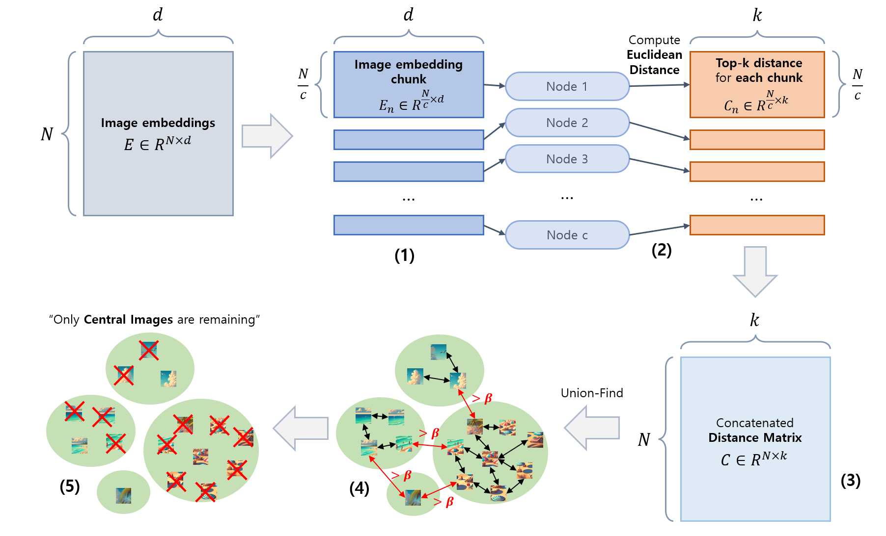

## 목차

* [1. CLIP-CID 의 핵심 아이디어](#1-clip-cid-의-핵심-아이디어)
* [2. CLIP-CID 의 방법론](#2-clip-cid-의-방법론)
  * [2-1. Image 의 Semantic Balance](#2-1-image-의-semantic-balance)
  * [2-2. Cluster-Level Distillation](#2-2-cluster-level-distillation)
  * [2-3. Instance-Level Distillation](#2-3-instance-level-distillation)
* [3. 실험 및 그 결과](#3-실험-및-그-결과)
  * [3-1. 실험 설정](#3-1-실험-설정)
  * [3-2. 실험 결과](#3-2-실험-결과)
  * [3-3. Ablation Study](#3-3-ablation-study)
  * [3-4. 실험 결론](#3-4-실험-결론)

## 논문 소개

* Kaicheng Yang and Tiancheng Gu et al., "CLIP-CID: Efficient CLIP Distillation via Cluster-Instance Discrimination"
* [AAAI Download Link](https://ojs.aaai.org/index.php/AAAI/article/download/35505/37660)

## 1. CLIP-CID 의 핵심 아이디어

CLIP-CID 의 핵심 아이디어 컨셉은 다음과 같다.

* [Contrastive Language-Image Pre-training (CLIP)](%5B2025.09.07%5D%20CLIPArTT%20-%20Adaption%20of%20CLIP%20to%20New%20Domains%20at%20Test%20Time.md#1-1-기존-clip-방법-및-그-문제점) 에 대한 **새로운 [Knowledge Distillation](../../AI%20Basics/Deep%20Learning%20Basics/딥러닝_기초_Knowledge_Distillation.md) 방법** 제안 
* 다음을 결합하여 **보다 효과적인 Knowledge Distillation** 이 될 수 있게 함
  * Cluster Discrimination
  * Instance Discrimination

## 2. CLIP-CID 의 방법론

**CLIP-CID (CLIP Cluster-Instance Distillation)** 의 방법론은 다음과 같다.

| 방법론                         | 설명                                                                                                                                                                                                                          |
|-----------------------------|-----------------------------------------------------------------------------------------------------------------------------------------------------------------------------------------------------------------------------|
| Image 의 Semantic Balance    | 간단하지만 효과적인 **image semantic balance 방법론** 을 제시한다.                                                                                                                                                                           |
| Cluster-level Distillation  | **Cluster Discrimination 기반 Knowledge Distillation** 을 통해 학습 데이터의 **잠재적인 semantic structure** 를 파악한다.                                                                                                                       |
| Instance-level Distillation | - Cluster-Level Distillation 은 **Student Image Encoder 가 학습 데이터의 복잡한 패턴을 찾아낼 수 있게** 한다. - 그러나, **Fine-grained Semantic Detail** 의 뉘앙스가 일정 부분 학습되지 못할 수 있다. - 이를 해결하기 위해, **Instance-Level Distillation Loss** 를 적용한다. |

* 전체 Loss Function
  * $L_{overall} = L_{base} + L_{cluster} + L_{instance}$
* 각 Loss Term 설명

| Loss Term      | 설명                                                                                                                                              | 참고 링크                                                                                                                                                                      |
|----------------|-------------------------------------------------------------------------------------------------------------------------------------------------|----------------------------------------------------------------------------------------------------------------------------------------------------------------------------|
| $L_{base}$     | Standard CLIP Loss = $L_{contrast}(e_i^s, c_i^s)$                                                                                               | [Contrastive Language-Image Pre-training (CLIP)](%5B2025.09.07%5D%20CLIPArTT%20-%20Adaption%20of%20CLIP%20to%20New%20Domains%20at%20Test%20Time.md#1-1-기존-clip-방법-및-그-문제점) |
| $L_{cluster}$  | **Cluster-Level Distillation** 에 대한 Loss - Softmax Classification Loss + KL Divergence Loss - $L_{cluster} = \alpha L_l + (1-\alpha) L_d$ | [2-2. Cluster-Level Distillation](#2-2-cluster-level-distillation)                                                                                                         |
| $L_{instance}$ | **Instance-Level Distillation** 에 대한 Loss - Teacher 와 Student 의 Embedding 간의 **Bi-directional Loss**                                         | [2-3. Instance-Level Distillation](#2-3-instance-level-distillation)                                                                                                       |

### 2-1. Image 의 Semantic Balance

**CLIP-CID** 의 목표는 **perceptual redundancy 와 semantic redundancy 문제를 모두 해결** 하는 것이다.

* Perceptual / Semantic Redundancy 설명

| redundancy            | 설명                                                               |
|-----------------------|------------------------------------------------------------------|
| Perceptual Redundancy | 픽셀 단위 수준의 작은 오차                                                  |
| Semantic Redundancy   | 비슷한 semantic information (컨셉) 을 유지하면서도 **픽셀 관점에서는 아주 큰 차이** 가 있음 |

[(출처)](https://arxiv.org/pdf/2405.00754) : Kaicheng Yang and Tiancheng Gu et al., "CLIP-CID: Efficient CLIP Distillation via Cluster-Instance Discrimination", 2025

**1. CLIP-CID 에서의 Redundancy 해결 방법**

* CLIP-CID 에서는 다음과 같은 방법으로 위 Redundancy 를 처리한다.

| 구분        | 설명                                                            |
|-----------|---------------------------------------------------------------|
| 모델        | OPENCLIP ViT-bigG/14                                          |
| 데이터셋      | LAION-400M                                                    |
| 메모리 절약 방법 | - 모든 이미지 임베딩을 c 개의 chunk 로 분리 - 이 chunk 들을 서로 다른 node 에 분배 |

* 상세 알고리즘

| 순서  | 설명                                                                                                                                                      |
|-----|---------------------------------------------------------------------------------------------------------------------------------------------------------|
| (1) | 모든 이미지 임베딩 ($E_n \in R^{\frac{N}{c} \times D}$ ) 을 **c 개의 chunk 로 분할**                                                                                  |
| (2) | 각 분할된 chunk 를 서로 다른 node 에 할당 후, **각 이미지 간의 Euclidean Distance 계산**                                                                                     |
| (3) | - 각 chunk 에 대한 **Top-k Distance 계산 결과** 를 **Distance Matrix $C \in R^{\frac{N}{c} \times k}$ 에 저장** - 이후 concatenate 하여 $C \in R^{N \times k}$ 으로 변환 |
| (4) | **Union Find (with distance threshold $\beta$)** 알고리즘을 이용하여 **Semantic 하게 유사한 이미지를 그룹화**                                                                |
| (5) | 각 그룹에서 **centroid 에 가장 가까운 central image** 만 남기고 제거                                                                                                     |

* 위 과정을 거치면 **LAION-400M 데이터셋의 이미지 개수가 400M → 225M (LAION-225M)** 으로 축소된다.
  * LAION-400M 데이터셋의 Cluster No. 에 따른 이미지 개수 분포

[(출처)](https://arxiv.org/pdf/2405.00754) : Kaicheng Yang and Tiancheng Gu et al., "CLIP-CID: Efficient CLIP Distillation via Cluster-Instance Discrimination", 2025

### 2-2. Cluster-Level Distillation

**Cluster-Level Distillation** 의 목적 및 핵심 아이디어는 다음과 같다.

| 구분      | 설명                                                                                                                   |
|---------|----------------------------------------------------------------------------------------------------------------------|
| 목적      | 학습 데이터의 **잠재적인 Semantic Structure** 파악                                                                               |
| 핵심 아이디어 | **Cluster Discrimination** 기반 Knowledge Distillation - Clustering 을 통해 각 이미지를 labeling 후, **Cluster Center 를 계산** |

[(출처)](https://arxiv.org/pdf/2405.00754) : Kaicheng Yang and Tiancheng Gu et al., "CLIP-CID: Efficient CLIP Distillation via Cluster-Instance Discrimination", 2025

**1. Clustering**

* [K-means Clustering](../../AI%20Basics/Machine%20Learning%20Models/머신러닝_모델_K-means_Clustering.md) 을 이용하여 클러스터링 실시 **(정규화된 임베딩 기준)**
* 이미지 임베딩에 **OPENCLIP ViT-bigG/14** 모델 사용
* intra-class impurity & inter-class conflict 줄이는 방법

| 구분                      | 방법                                                 |
|-------------------------|----------------------------------------------------|
| intra-class impurity 감소 | **Cluster 의 개수** 조정                                |
| inter-class conflict 감소 | Mini-batch 에서 샘플링되는 **negative instance 의 개수를 줄임** |

**2. Cluster Discrimination Distillation**

* Pseudo-Label & Teacher / Student Prediction 도출

* Teacher / Student Prediction 을 이용한 Clustering Loss 계산

* Loss 수식

[(출처)](https://arxiv.org/pdf/2405.00754) : Kaicheng Yang and Tiancheng Gu et al., "CLIP-CID: Efficient CLIP Distillation via Cluster-Instance Discrimination", 2025

| notation     | 설명                                                                                                                         |
|--------------|----------------------------------------------------------------------------------------------------------------------------|
| $w_i$, $w_j$ | image 에 대한 k 개의 class, $W = \lbrace w_i \rbrace_{i=1}^k$                                                                   |
| $\tau$       | 확률분포 조정을 위한 temperature [(참고)](../../AI%20Basics/Deep%20Learning%20Basics/딥러닝_기초_Knowledge_Distillation.md#4-1-soft-label) |
| $\alpha$     | 각 Loss 간의 밸런스를 맞추기 위한 weight                                                                                               |

### 2-3. Instance-Level Distillation

**Instance-Level Distillation** 의 목적 및 핵심 아이디어는 다음과 같다.

- Cluster-Level Distillation 은 **Student Image Encoder 가 학습 데이터의 복잡한 패턴을 찾아낼 수 있게** 한다. - 그러나, **Fine-grained Semantic Detail** 의 뉘앙스가 일정 부분 학습되지 못할 수 있다. - 이를 해결하기 위해, **Instance-Level Distillation Loss** 를 적용한다.

| 구분      | 설명                                                                                        |
|---------|-------------------------------------------------------------------------------------------|
| 목적      | Cluster-Level Distillation 이 **Fine-grained Semantic Detail의 뉘앙스** 를 일정 부분 학습하지 못하는 문제 해결 |
| 핵심 아이디어 | Teacher Embedding - Student Embedding 간 **Bi-directional Loss** 적용                        |

[(출처)](https://arxiv.org/pdf/2405.00754) : Kaicheng Yang and Tiancheng Gu et al., "CLIP-CID: Efficient CLIP Distillation via Cluster-Instance Discrimination", 2025

* **1. Loss Function 계산 개요**

* **2. Loss Function 수식**

[(출처)](https://arxiv.org/pdf/2405.00754) : Kaicheng Yang and Tiancheng Gu et al., "CLIP-CID: Efficient CLIP Distillation via Cluster-Instance Discrimination", 2025

## 3. 실험 및 그 결과

### 3-1. 실험 설정

* 모델 구현 상세

| 항목                                                                                                                      | 설정값                                                                                                                    |
|-------------------------------------------------------------------------------------------------------------------------|------------------------------------------------------------------------------------------------------------------------|
| Teacher Model                                                                                                           | OPENCLIP bigG/14                                                                                                       |
| Student Model                                                                                                           | CLIP 과 동일 구조                                                                                                           |
| Distillation Training 대상 모델                                                                                             | [ViT](../../Image%20Processing/Basics_Vision_Transformer_ViT.md)-B/32 & ViT-B/16                                       |
| [Optimizer](../../AI%20Basics/Deep%20Learning%20Basics/딥러닝_기초_Optimizer.md)                                             | [AdamW](../../AI%20Basics/Deep%20Learning%20Basics/딥러닝_기초_Optimizer.md#2-3-adamw) ($\beta_1 = 0.9, \beta_2 = 0.98$) |
| Initial [Learning Rate](../../AI%20Basics/Deep%20Learning%20Basics/딥러닝_기초_Learning_Rate.md)                             | 1e-3 (= 0.001)                                                                                                         |
| Initial [Learning Rate](../../AI%20Basics/Deep%20Learning%20Basics/딥러닝_기초_Learning_Rate.md) **(Fully-Connected Layer)** | 1e-6 (= 0.000001) **(학습 중 collapse 방지 목적)**                                                                            |
| [Weight Decay](../../AI%20Basics/Deep%20Learning%20Basics/딥러닝_기초_Optimizer.md#1-1-중요-개념-weight-decay)                   | 0.2                                                                                                                    |
| Loss weights                                                                                                            | $\alpha = 0.999, \gamma = 0.5$                                                                                         |
| Temperature parameter                                                                                                   | $\tau = 0.07$                                                                                                          |
| Epochs                                                                                                                  | 32 epochs                                                                                                              |
| GPU                                                                                                                     | 64 NVIDIA H800 GPUs                                                                                                    |

* 학습 데이터 상세

| 항목                 | 설정값                                                        |
|--------------------|------------------------------------------------------------|
| Downstream Dataset | Food101, CIFAR10, CIFAR100, Bird-snap, Stanford Cars 등 14개 |
| 입력 이미지 크기 (해상도)    | 224 x 224                                                  |
| 입력 텍스트 길이          | 77 (truncated or padded)                                   |

### 3-2. 실험 결과

### 3-3. Ablation Study

### 3-4. 실험 결론
