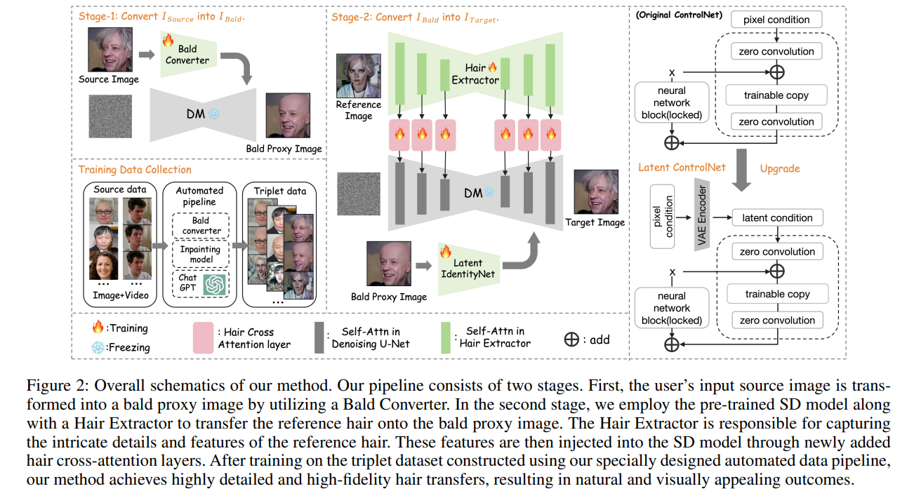
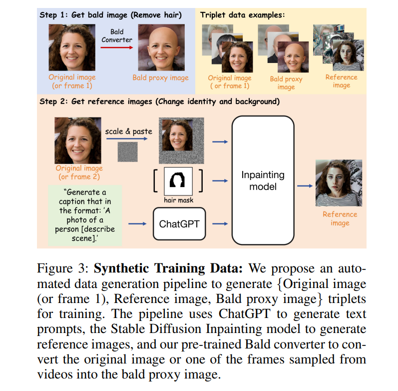
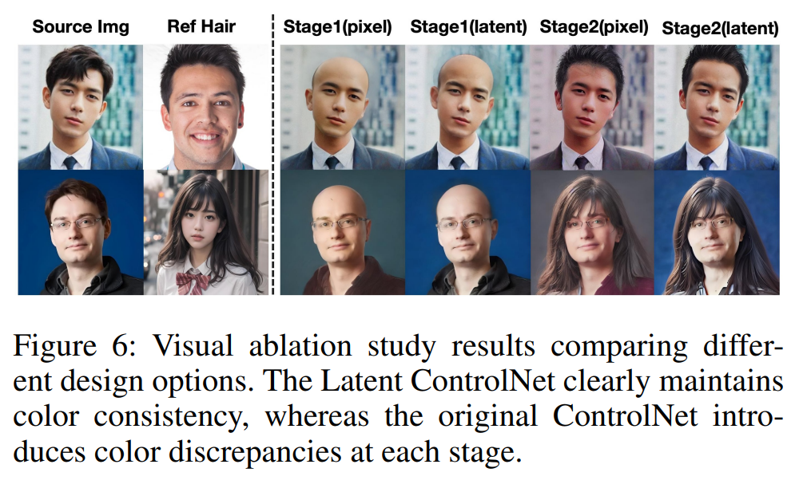
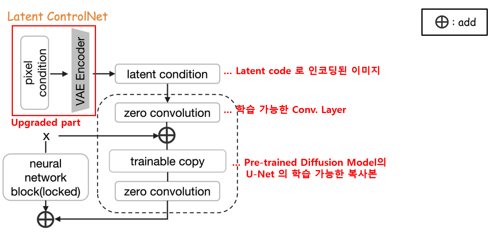
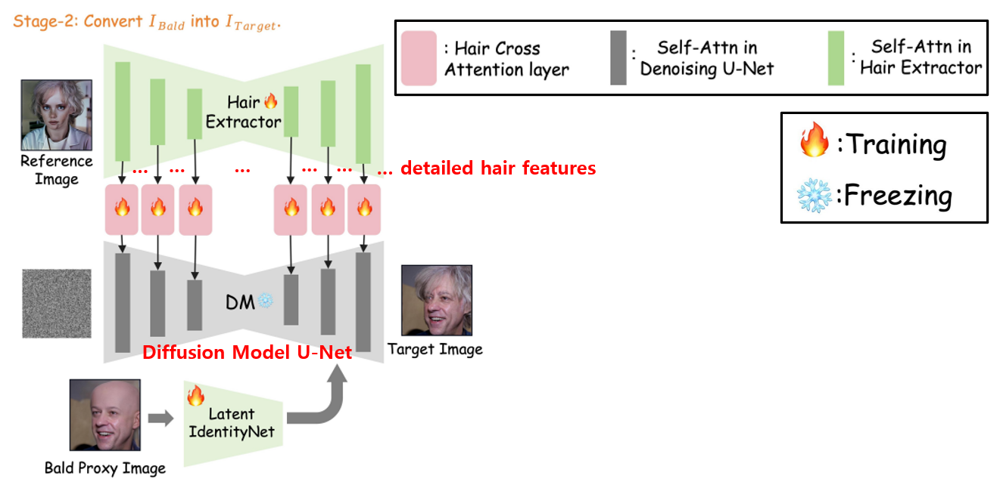
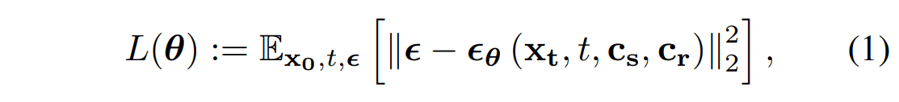

## 목차

* [1. Stable-Hair 개요 및 핵심 아이디어](#1-stable-hair-개요-및-핵심-아이디어)
* [2. Stable-Hair 의 방법](#2-stable-hair-의-방법)
  * [2-1. Stage 1. Bald State 로 정규화](#2-1-stage-1-bald-state-로-정규화---bald-converter)
  * [2-2. Stage 1. Bald State 로 정규화 - 학습 데이터 수집](#2-2-stage-1-bald-state-로-정규화---학습-데이터-수집)
  * [2-3. Stage 2. Hair Transfer & Integration](#2-3-stage-2-hair-transfer--integration) 
* [3. 모델 학습 & Loss Function](#3-모델-학습--loss-function)
* [4. 실험 및 그 결과](#4-실험-및-그-결과)
  * [4-1. 실험 구현 상세](#4-1-실험-구현-상세)
  * [4-2. 평가 Metric](#4-2-평가-metric)
  * [4-3. 실험 결과](#4-3-실험-결과)

## 논문 소개

* Yuxuan Zhang and Qing Zhang et al., "Stable-Hair: Real-World Hair Transfer via Diffusion Model"
* [AAAI Download Link](https://ojs.aaai.org/index.php/AAAI/article/view/33123/35278)

## 1. Stable-Hair 개요 및 핵심 아이디어

**Stable-Hair** 는 [Diffusion Model](../../Generative%20AI/Basics_Diffusion%20Model.md) 을 기반으로 한 **최초의 헤어스타일 수정 프레임워크** 이다.

* 핵심 아이디어

| 핵심 아이디어                  | 설명                                                                                                                   |
|--------------------------|----------------------------------------------------------------------------------------------------------------------|
| Hair Extractor           | reference image 를 인코딩하고, 또 **상세한 hair feature 를 주입** 한다.                                                             |
| 새로운 Latent ControlNet 구조 | - Bald Converter (기존 헤어스타일 이미지를 Bald 이미지로 변환)<br>- pixel space 에서의 헤어스타일 변환 프로세스를 **latent space 에서의 프로세스로 mapping** |

## 2. Stable-Hair 의 방법

* Stable-Hair 방법의 전체 구조



[(출처)](https://ojs.aaai.org/index.php/AAAI/article/view/33123/35278) : Yuxuan Zhang and Qing Zhang et al., "Stable-Hair: Real-World Hair Transfer via Diffusion Model"

* Stable-Hair 방법의 단계
  * 아래와 같은 two-stage 방법을 통해 **헤어스타일 변환을 안정적으로 진행** 할 수 있으며, **원본 이미지의 내용을 유지** 할 수 있다.

| 단계                                        | 설명                                                                                  |
|-------------------------------------------|-------------------------------------------------------------------------------------|
| Stage 1 **(Bald State 로 정규화)**            | 입력된 원본 이미지를 **bald 헤어스타일의 proxy image** 로 변환<br>- 이때 **Bald Converter** 를 이용        |
| Stage 2 **(Hair Transfer & Integration)** | reference hair 이미지를, **bald 헤어스타일의 proxy image** 를 baseline 으로 해서 **그 특징을 합성하여** 변환 |

### 2-1. Stage 1. Bald State 로 정규화 - Bald Converter

**Bald Converter** 는 다음과 같은 역할을 한다.

* 입력된 원본 이미지를 **Bald 헤어스타일의 proxy image 로 변환**
  * 기본적인 형태의 Diffusion 모델과 **본 연구에서 설계한 Latent ControlNet을 결합** 시킨 형태
  * 학습된 Bald Converter 는 **추가적인 image alignment 등 작업 없이도 원본 이미지에서 hair 영역을 제거** 할 수 있음 
* 원본 이미지를 **Bald image 로 정규화** 하는 것이 중요한 이유는 다음과 같다.
  * 헤어스타일 변환에서 모델 성능 향상
  * 성능 향상의 이유는 **hair 영역을 제거** 함으로써 **모델이 hair 영역 대신 얼굴 영역의 feature 등에 집중** 할 수 있기 때문

### 2-2. Stage 1. Bald State 로 정규화 - 학습 데이터 수집

**Bald Converter 의 학습이 완료** 되면, 이를 이용하여 **헤어스타일 변환에 필요한 학습 데이터셋을 생성** 할 수 있다.

* 학습 데이터 구성

| 학습 데이터          | 설명                               | 생성에 사용된 모델<br>(또는 생성 방법)                                                                                                                           |
|-----------------|----------------------------------|----------------------------------------------------------------------------------------------------------------------------------------------------|
| bald 헤어스타일 이미지  | 학습에 필요한 bald head 이미지            | **Bald Converter**                                                                                                                                 |
| Original image  | 입력된 원본 이미지                       |                                                                                                                                                    |
| Reference image | Original image 와는 **다른 포즈의** 이미지 | - **ChatGPT** 를 이용하여 **Original image** 에서 **non-hairstyle 에 해당하는 부분의 caption** 을 생성<br>- 이 caption을 hair mask 와 함께 **inpainting model** 에 입력하여 생성 |



[(출처)](https://ojs.aaai.org/index.php/AAAI/article/view/33123/35278) : Yuxuan Zhang and Qing Zhang et al., "Stable-Hair: Real-World Hair Transfer via Diffusion Model"

**상세 과정 설명**

| 순서 | Step   | 과정 설명                                                                                     |
|----|--------|-------------------------------------------------------------------------------------------|
| 1  | Step 1 | Bald Converter 를 이용하여 **Bald Proxy Image** 생성                                             |
| 2  | Step 2 | Original image 의 **hair mask 를 생성**<br>scale & paste → Segmentation 추정                    |
| 3  | Step 2 | ChatGPT를 이용하여 Original image 의 **hair 를 제외한 영역에 대한 caption** 생성                           |
| 4  | Step 2 | **hair mask + caption + original image** 를 Inpainting Model 에 입력하여 **Reference Image** 생성 |

### 2-3. Stage 2. Hair Transfer & Integration

**Hair Transfer & Integration** 는 Bald proxy image 에 **reference image** 의 헤어스타일을 합성하는 것이다.

* 이때 **원본 이미지의 content consistency** 가 중요하다.
* 따라서 헤어스타일 변환에 있어서 **maintenance module** 의 구현이 매우 중요하다.

**1. ControlNet 구조**

content consistency 를 유지하는 헤어스타일 변환의 기본적인 방법은 다음과 같은 **ControlNet** 구조를 이용하는 것이다.

* ControlNet 구조에는 **Bald Converter** 와 **Latent IdentityNet** 이 포함된다.
* 그러나, ControlNet 을 이용한 실험 결과는 다음과 같은 특징을 보인다.
  * **원본 이미지의 구조적 consistency** 는 유지
  * 그러나, **color consistency 를 유지하는 데 어려움이 있음**
  * 이러한 어려움의 근본적인 원인은 **ControlNet 의 pixel space** 와 **U-Net 의 latent space** 가 근본적으로 서로 다른 방식으로 동작하기 때문으로 추정된다.



[(출처)](https://ojs.aaai.org/index.php/AAAI/article/view/33123/35278) : Yuxuan Zhang and Qing Zhang et al., "Stable-Hair: Real-World Hair Transfer via Diffusion Model"

**2. Latent ControlNet 구조 (✅ 본 연구에서 채택)**

**Latent ControlNet** 은 **ControlNet의 문제점을 개선한, ControlNet의 변형** 중 하나이다.



[(출처)](https://ojs.aaai.org/index.php/AAAI/article/view/33123/35278) : Yuxuan Zhang and Qing Zhang et al., "Stable-Hair: Real-World Hair Transfer via Diffusion Model"

* 이미지가 ControlNet에 입력되기 전에, **[VAE](../../Generative%20AI/Basics_Variational%20Auto%20Encoder.md) Encoder 를 이용하여 Latent Space 로 인코딩** 된다.
* 인코딩된 이미지는 **새로운 학습 가능한 Conv. Layer → U-Net 의 학습 가능한 복사본으로 전달** 된다.

**3. Hair Extractor**

**Hair Extractor** 는 **Reference Image 에 있는 헤어스타일 정보를 상세하고 정확히** 변환해야 한다.



[(출처)](https://ojs.aaai.org/index.php/AAAI/article/view/33123/35278) : Yuxuan Zhang and Qing Zhang et al., "Stable-Hair: Real-World Hair Transfer via Diffusion Model"

* 본 연구에서는 Hair Extractor 로 **Pre-trained [Diffusion Model](../../Generative%20AI/Basics_Diffusion%20Model.md) 의 U-Net 의 학습 가능한 복사본** 을 사용한다.
* Hair Extractor 동작 원리
  * Reference Image 를 **Hair Extractor 를 이용하여 인코딩**
  * 이후, 각 transformer block 의 self-attention layer 로부터 상세한 hair feature 를 얻는다.
  * 이후 이 feature들은 **Diffusion 모델의 U-Net** 으로 주입된다.
* 이때, 각 Transformer Block 에서는 다음 정보가 보존된다.
  * 원래 Self-Attention Layers
  * 추가된 Hair Cross-Attention Layers

## 3. 모델 학습 & Loss Function

**Stable-Hair** 의 모델 학습은 다음과 같이 2개의 단계로 구성된다.

| 단계      | 설명                                                                                        |
|---------|-------------------------------------------------------------------------------------------|
| Stage 1 | Bald Converter 를 ControlNet과 유사한 방법으로 학습<br>- 이를 통해 **성능 좋은 Bald Converter 를 학습** 시킬 수 있음 |
| Stage 2 | 다음 모델을 학습시키는 데 주안점<br>- Hair Extractor<br>- Latent IdentityNet                            |

**1. Image Augmentation**

* 실제 현실을 잘 반영하고 성능 좋은 헤어스타일 변환을 위해 **다양한 Augmentation 방법** 적용
* Augmentation 예시

| Augmentation                       | 적용 대상                                                  |
|------------------------------------|--------------------------------------------------------|
| Synchronized Affine Transformation | - Source image<br>- Bald proxy image<br>- Target image |

**2. Loss Function**

* 기본 컨셉
  * 모델은 **Noisy Latent Data 를 생성하기 위해 사용된 Added Noise** 에 대한 예측 오차를 줄여야 함  
  * 따라서, **Normal Distribution 을 따르는 Added Noise** 와의 **[MSE (Mean-Squared Error) Loss](../../AI%20Basics/Deep%20Learning%20Basics/딥러닝_기초_Loss_function.md#2-1-mean-squared-error-mse)** 컨셉을 적용 
* 적용 범위
  * **Stage 1, Stage 2** 모두에 적용
* 수식



[(출처)](https://ojs.aaai.org/index.php/AAAI/article/view/33123/35278) : Yuxuan Zhang and Qing Zhang et al., "Stable-Hair: Real-World Hair Transfer via Diffusion Model"

| notation        | 설명                                                               |
|-----------------|------------------------------------------------------------------|
| $x_t$           | added noise 에 의해 생성된 **noisy latent data**                       |
| $x_0$           | image latent                                                     |
| $\epsilon$      | **added noise**, $\epsilon \in N(0, 1)$                          |
| $\epsilon_0(·)$ | added noise 를 예측하기 위한 모델                                         |
| $c_s$           | **Source Condition Input** (원본 이미지 또는 bald proxy image)          |
| $c_r$           | **Reference Condition Input** (bald converter 학습 시에는 ```None```) |

## 4. 실험 및 그 결과

### 4-1. 실험 구현 상세

### 4-2. 평가 Metric

### 4-3. 실험 결과