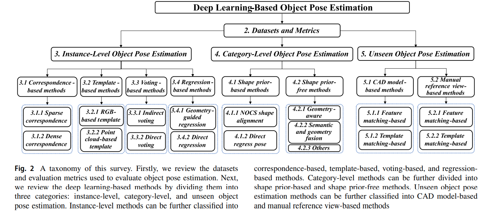
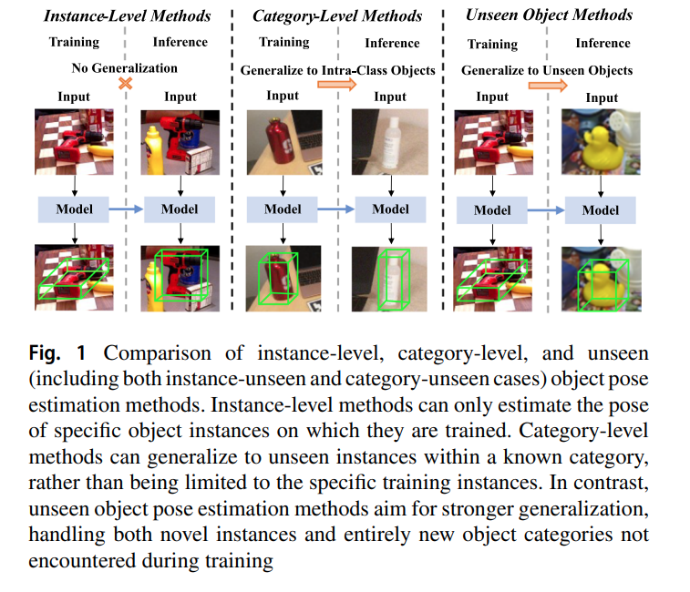

## 목차

* [1. 논문 개요](#1-논문-개요)
* [2. 딥러닝 기반 Pose Estimation 개요](#2-딥러닝-기반-pose-estimation-개요)
* [3. 데이터셋 및 평가 메트릭](#3-데이터셋-및-평가-메트릭)
  * [3-1. 데이터셋 (Instance-Level 방법론)](#3-1-데이터셋-instance-level-방법론)
  * [3-2. 데이터셋 (Category-Level 방법론)](#3-2-데이터셋-category-level-방법론)
  * [3-3. 데이터셋 (Unseen Object)](#3-3-데이터셋-unseen-object)
  * [3-4. 평가 메트릭](#3-4-평가-메트릭)
* [4. Instance-Level Pose Estimation](#4-instance-level-pose-estimation)
  * [4-1. Correspondence (일치) 기반 방법론](#4-1-correspondence-일치-기반-방법론)
  * [4-2. 템플릿 기반 방법론](#4-2-템플릿-기반-방법론)
  * [4-3. Voting (투표) 기반 방법론](#4-3-voting-투표-기반-방법론)
  * [4-4. Regression (회귀) 기반 방법론](#4-4-regression-회귀-기반-방법론)
* [5. Category-Level Pose Estimation](#5-category-level-pose-estimation)
* [6. Unseen Object Pose Estimation](#6-unseen-object-pose-estimation)
* [7. Pose Estimation의 응용](#7-pose-estimation의-응용)

## 논문 소개

* Jian Liu and Wei Sun et al., "Deep Learning-Based Object Pose Estimation: A Comprehensive Survey"
* [arXiv Link](https://arxiv.org/pdf/2405.07801)

## 1. 논문 개요

* 이 논문의 주요 내용은 다음과 같다.
  * 딥 러닝 기반 **물체의 Pose Estimation 방법** 들에 대한 **종합적 조사**
  * input data의 **주요 모달리티** (RGB, depth, RGBD 이미지), output data의 **서로 다른 자유도** 를 커버함
  * Pose Estimation의 도메인을 **instance-level, category-level, unseen object** 의 3가지로 분류

## 2. 딥러닝 기반 Pose Estimation 개요

* 딥러닝 기반 Pose Estimation 연구의 taxonomy

[(출처)](https://ojs.aaai.org/index.php/AAAI/article/view/33123/35278) : Jian Liu and Wei Sun et al., "Deep Learning-Based Object Pose Estimation: A Comprehensive Survey"

* **instance-level, category-level, unseen object** 각 도메인 별 method 개요

[(출처)](https://ojs.aaai.org/index.php/AAAI/article/view/33123/35278) : Jian Liu and Wei Sun et al., "Deep Learning-Based Object Pose Estimation: A Comprehensive Survey"

| 방법론 도메인                            | 설명                                   | 일반화 여부       | 기존 방법론의 문제점                                     |
|------------------------------------|--------------------------------------|--------------|-------------------------------------------------|
| **instance-level** pose estimation | **특정 객체** 에 대한 pose estimation 실시    | 일반화 없음       |                                                 |
| **category-level** pose estimation | **알려진 카테고리의 객체 (새로운 객체 포함)** 에 대해 실시 | 물체의 '알려진 종류' | **instance-level** 방법은 **학습된 바로 그 물체** 에만 적용 가능 |
| **unseen object** pose estimation  | **새로운 물체** 및 **새로운 카테고리의 물체** 처리 가능  | 새로운 물체       | 새로운 'unseen object'를 일반화하기 어려움                  |

## 3. 데이터셋 및 평가 메트릭

### 3-1. 데이터셋 (Instance-Level 방법론)

### 3-2. 데이터셋 (Category-Level 방법론)

### 3-3. 데이터셋 (Unseen Object)

### 3-4. 평가 메트릭

## 4. Instance-Level Pose Estimation

### 4-1. Correspondence (일치) 기반 방법론

### 4-2. 템플릿 기반 방법론

### 4-3. Voting (투표) 기반 방법론

### 4-4. Regression (회귀) 기반 방법론

## 5. Category-Level Pose Estimation

## 6. Unseen Object Pose Estimation

## 7. Pose Estimation의 응용
