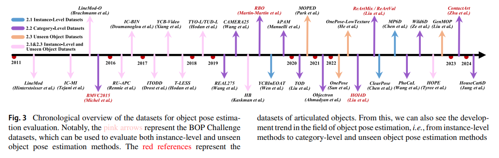
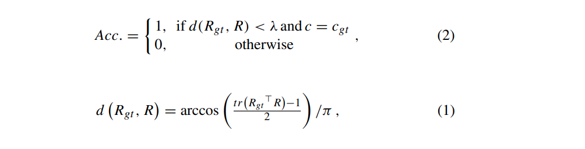
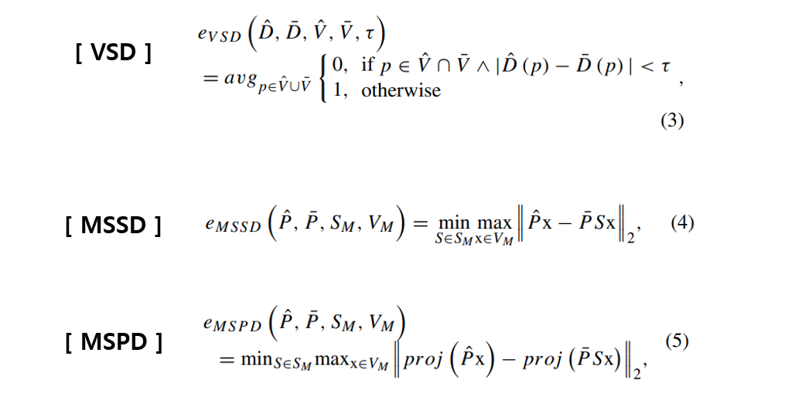

## 목차

* [1. 논문 개요](#1-논문-개요)
* [2. 딥러닝 기반 Pose Estimation 개요](#2-딥러닝-기반-pose-estimation-개요)
* [3. 데이터셋 및 평가 메트릭](#3-데이터셋-및-평가-메트릭)
  * [3-1. 데이터셋 (Instance-Level 방법론)](#3-1-데이터셋-instance-level-방법론)
  * [3-2. 데이터셋 (Category-Level 방법론)](#3-2-데이터셋-category-level-방법론)
  * [3-3. 데이터셋 (Unseen Object)](#3-3-데이터셋-unseen-object)
  * [3-4. 평가 메트릭](#3-4-평가-메트릭)
* [4. Instance-Level Pose Estimation](#4-instance-level-pose-estimation)
  * [4-1. Correspondence (일치) 기반 방법론](#4-1-correspondence-일치-기반-방법론)
  * [4-2. 템플릿 기반 방법론](#4-2-템플릿-기반-방법론)
  * [4-3. Voting (투표) 기반 방법론](#4-3-voting-투표-기반-방법론)
  * [4-4. Regression (회귀) 기반 방법론](#4-4-regression-회귀-기반-방법론)
* [5. Category-Level Pose Estimation](#5-category-level-pose-estimation)
* [6. Unseen Object Pose Estimation](#6-unseen-object-pose-estimation)
* [7. Pose Estimation의 응용](#7-pose-estimation의-응용)

## 논문 소개

* Jian Liu and Wei Sun et al., "Deep Learning-Based Object Pose Estimation: A Comprehensive Survey"
* [arXiv Link](https://arxiv.org/pdf/2405.07801)

## 1. 논문 개요

* 이 논문의 주요 내용은 다음과 같다.
  * 딥 러닝 기반 **물체의 Pose Estimation 방법** 들에 대한 **종합적 조사**
  * input data의 **주요 모달리티** (RGB, depth, RGBD 이미지), output data의 **서로 다른 자유도** 를 커버함
  * Pose Estimation의 도메인을 **instance-level, category-level, unseen object** 의 3가지로 분류

## 2. 딥러닝 기반 Pose Estimation 개요

* 딥러닝 기반 Pose Estimation 연구의 taxonomy

[(출처)](https://ojs.aaai.org/index.php/AAAI/article/view/33123/35278) : Jian Liu and Wei Sun et al., "Deep Learning-Based Object Pose Estimation: A Comprehensive Survey"

* **instance-level, category-level, unseen object** 각 도메인 별 method 개요

[(출처)](https://ojs.aaai.org/index.php/AAAI/article/view/33123/35278) : Jian Liu and Wei Sun et al., "Deep Learning-Based Object Pose Estimation: A Comprehensive Survey"

| 방법론 도메인                            | 설명                                   | 일반화 여부       | 기존 방법론의 문제점                                     |
|------------------------------------|--------------------------------------|--------------|-------------------------------------------------|
| **instance-level** pose estimation | **특정 객체** 에 대한 pose estimation 실시    | 일반화 없음       |                                                 |
| **category-level** pose estimation | **알려진 카테고리의 객체 (새로운 객체 포함)** 에 대해 실시 | 물체의 '알려진 종류' | **instance-level** 방법은 **학습된 바로 그 물체** 에만 적용 가능 |
| **unseen object** pose estimation  | **새로운 물체** 및 **새로운 카테고리의 물체** 처리 가능  | 새로운 물체       | 새로운 'unseen object'를 일반화하기 어려움                  |

## 3. 데이터셋 및 평가 메트릭

* Pose Estimation을 위한 데이터셋은 **Instance-Level, Category-Level, 그리고 Unseen Object** 에 대한 데이터셋으로 분류할 수 있다.
* 여기서는 관련된 평가 메트릭도 함께 소개한다.

[(출처)](https://ojs.aaai.org/index.php/AAAI/article/view/33123/35278) : Jian Liu and Wei Sun et al., "Deep Learning-Based Object Pose Estimation: A Comprehensive Survey"

### 3-1. 데이터셋 (Instance-Level 방법론)

**Instance-Level 방법론** 에 대한 벤치마크 데이터셋은 다음과 같다.

* BOP Challenge 데이터셋

| 데이터셋                                    | 주요 특징                      | 기본 구성                                         | 
|-----------------------------------------|----------------------------|-----------------------------------------------|
| Linemod Dataset (LM) (2012)             | 복잡한 장면, 질감 없는 물체, 조명 조건 다양 | annotation 된 RGBD 이미지로 구성된 15개의 RGBD sequence |
| Linemod Occlusion Dataset (LM-O) (2014) | 물체가 가려지는 시나리오              | 1214 개의 RGBD 이미지                              | | | |
| T-Less Dataset (2017)                   | 다양한 해상도의 이미지, 질감 없는 물체     | 명확한 질감이 없는 30개의 전자 제품 이미지                     |
| HOPE Dataset (2022)                     | 생활용품 분야 최적화                | HOPE-Image 데이터셋은 50장면으로 구성 (각 장면은 최대 5가지의 밝기) |

* 그 외 데이터셋

| 데이터셋                     | 주요 특징                  | 기본 구성                                                             | 
|--------------------------|------------------------|-------------------------------------------------------------------|
| ClearPose Dataset (2022) | 일상에서 자주 사용되는 투명한 물체 중심 | - 35만 개의 실제 RGBD 이미지 - 500만 개의 instance annotation (63개의 생활용품) |
| MP6D Dataset (2022)      | 금속 제품 중심               | 20,100개의 실제 이미지 (object pose label 포함) + 50,000개의 합성 이미지          |

### 3-2. 데이터셋 (Category-Level 방법론)

**Category-Level 방법론** 에 대한 벤치마크 데이터셋은 다음과 같다.

* Rigid Objects Dataset

| 데이터셋              | 주요 특징                           | 기본 구성                                                      |
|-------------------|---------------------------------|------------------------------------------------------------|
| CAMERA25 (2019)   | ShapeNet dataset (합성 데이터) 가 원본임 | - 1085개의 객체 (instance) - 6개의 물체 분류                      |
| REAL275 (2019)    | 학문 연구 데이터셋으로 활용됨                | - 18개의 동영상 (학습 7개, 검증 5개, 테스트 6개) - 6개 카테고리의 42개의 객체 포함 |
| HouseCat6D (2024) | 멀티모달 pose estimation 에 사용       | - 194개의 고품질 3D 모델 포함 - 다양한 viewpoint의 41개의 장면           |

* Articulated Objects Dataset

| 데이터셋                 | 주요 특징                                 | 기본 구성                                                       |
|----------------------|---------------------------------------|-------------------------------------------------------------|
| BMVC Dataset (2015)  | -                                     | - 노트북, 캐비닛, 컵보드, 장난감 기차의 4가지 object - CAD 모델 및 관련 텍스트 파일 |
| HOI4D Dataset (2022) | 인간-물체 상호작용 관련 연구 데이터셋                 | - 240만 개의 RGBD 비디오 프레임 - 800개의 object                    |
| ContactArt (2024)    | 정밀한 pose annotation을 위해 스마트폰 및 노트북 사용 | - 노트북, 쓰레기통 등 5가지 object - 총 80개의 instance               |

### 3-3. 데이터셋 (Unseen Object)

**Unseen Object 방법론** 에 대한 벤치마크 데이터셋은 다음과 같다.

| 데이터셋                      | 주요 특징                          | 기본 구성                                                                    |
|---------------------------|--------------------------------|--------------------------------------------------------------------------|
| MOPED Dataset (2020)      | -                              | - 11개의 생활용품에 대한 데이터 - reference image, test image                     |
| GenMOP Dataset (2022)     | -                              | - 10개의 object (flat object, thin object 위주) - 각 object에 대해 2개의 비디오 포함 |
| OnePose Dataset (2022)    | 학습, 검증 set으로 랜덤하게 분할됨          | 150개의 object에 대한 450개의 비디오 시퀀스 (다양한 배경 조건, 모든 각도)                        |
| OnePose-LowTexture (2022) | OnePose 데이터셋의 테스트셋에 대한 보충 데이터셋 | 40개의 생활용품 데이터셋 - 각 object에 대해 2개의 비디오 시퀀스 포함                          |

### 3-4. 평가 메트릭

* Pose Estimation 에 사용되는 metric 들은 다음과 같다.

| 3DoF                  | 6DoF                  | 9DoF                         |
|-----------------------|-----------------------|------------------------------|
| 3개의 회전축 (x, y, z축) 기준 | 3개의 회전축 + **위치 (이동)** | 3개의 회전축 + 위치(이동) + **추가 3축** |

**1. 3DoF (3축 자유도) metric**

* 정확도 평가 기준

[(출처)](https://ojs.aaai.org/index.php/AAAI/article/view/33123/35278) : Jian Liu and Wei Sun et al., "Deep Learning-Based Object Pose Estimation: A Comprehensive Survey"

| notation       | 설명                                                                |
|----------------|-------------------------------------------------------------------|
| $d(R_{gt}, R)$ | 비교 대상 3D 회전 $R$, $R_{gt}$ 간의 **relative deviation = angle error** |
| $tr$           | 행렬의 주대각선 성분의 합                                                    |
| $R$            | 예측된 3D 회전                                                         |
| $R_{gt}$       | ground-truth 3D 회전                                                |
| $c$            | 예측된 class                                                         |
| $c_{gt}$       | ground-truth class                                                |
| $\lambda$      | 사전 정의된 threshold                                                  |

**2. 6DoF (6축 자유도) metric**

[(출처)](https://ojs.aaai.org/index.php/AAAI/article/view/33123/35278) : Jian Liu and Wei Sun et al., "Deep Learning-Based Object Pose Estimation: A Comprehensive Survey"

* distance map $D$ 와 픽셀 $p$ 에 대해, $D(p)$ 는 **카메라 중심과 3D point $x_p$ 사이의 거리** 를 저장한다.

| notation             | 설명                                                                              |
|----------------------|---------------------------------------------------------------------------------|
| $\hat{P}$, $\bar{P}$ | 각각 **estimated** pose, **ground-truth** pose                                    |
| $\hat{D}$, $\bar{D}$ | object model $M$ 에 의해 생성된 distance map (서로 다른 2개의 pose $\hat{P}$, $\bar{P}$ 기준) |

## 4. Instance-Level Pose Estimation

### 4-1. Correspondence (일치) 기반 방법론

### 4-2. 템플릿 기반 방법론

### 4-3. Voting (투표) 기반 방법론

### 4-4. Regression (회귀) 기반 방법론

## 5. Category-Level Pose Estimation

## 6. Unseen Object Pose Estimation

## 7. Pose Estimation의 응용
