## 목차

* [1. 논문 개요](#1-논문-개요)
* [2. 딥러닝 기반 Pose Estimation 개요](#2-딥러닝-기반-pose-estimation-개요)
* [3. 데이터셋 및 평가 메트릭](#3-데이터셋-및-평가-메트릭)
  * [3-1. 데이터셋 (Instance-Level 방법론)](#3-1-데이터셋-instance-level-방법론)
  * [3-2. 데이터셋 (Category-Level 방법론)](#3-2-데이터셋-category-level-방법론)
  * [3-3. 데이터셋 (Unseen Object)](#3-3-데이터셋-unseen-object)
  * [3-4. 평가 메트릭](#3-4-평가-메트릭)
* [4. Instance-Level Pose Estimation](#4-instance-level-pose-estimation)
  * [4-1. Correspondence (일치) 기반 방법론](#4-1-correspondence-일치-기반-방법론)
  * [4-2. 템플릿 기반 방법론](#4-2-템플릿-기반-방법론)
  * [4-3. Voting (투표) 기반 방법론](#4-3-voting-투표-기반-방법론)
  * [4-4. Regression (회귀) 기반 방법론](#4-4-regression-회귀-기반-방법론)
* [5. Category-Level Pose Estimation](#5-category-level-pose-estimation)
* [6. Unseen Object Pose Estimation](#6-unseen-object-pose-estimation)
* [7. Pose Estimation의 응용](#7-pose-estimation의-응용)

## 논문 소개

* Jian Liu and Wei Sun et al., "Deep Learning-Based Object Pose Estimation: A Comprehensive Survey"
* [arXiv Link](https://arxiv.org/pdf/2405.07801)

## 1. 논문 개요

* 이 논문의 주요 내용은 다음과 같다.
  * 딥 러닝 기반 **물체의 Pose Estimation 방법** 들에 대한 **종합적 조사**
  * input data의 **주요 모달리티** (RGB, depth, RGBD 이미지), output data의 **서로 다른 자유도** 를 커버함
  * Pose Estimation의 도메인을 **instance-level, category-level, unseen object** 의 3가지로 분류

## 2. 딥러닝 기반 Pose Estimation 개요

* 딥러닝 기반 Pose Estimation 연구의 taxonomy

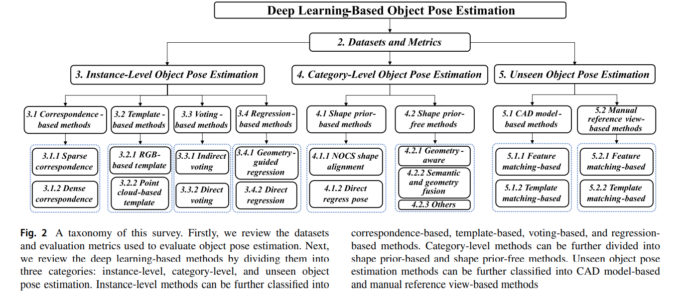

[(출처)](https://ojs.aaai.org/index.php/AAAI/article/view/33123/35278) : Jian Liu and Wei Sun et al., "Deep Learning-Based Object Pose Estimation: A Comprehensive Survey"

* **instance-level, category-level, unseen object** 각 도메인 별 method 개요

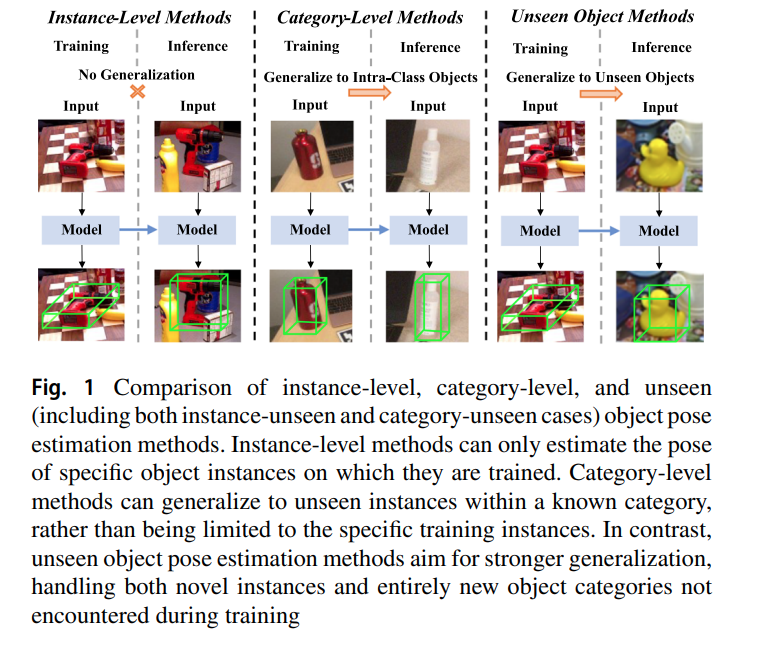

[(출처)](https://ojs.aaai.org/index.php/AAAI/article/view/33123/35278) : Jian Liu and Wei Sun et al., "Deep Learning-Based Object Pose Estimation: A Comprehensive Survey"

| 방법론 도메인                            | 설명                                   | 일반화 여부       | 기존 방법론의 문제점                                     |
|------------------------------------|--------------------------------------|--------------|-------------------------------------------------|
| **instance-level** pose estimation | **특정 객체** 에 대한 pose estimation 실시    | 일반화 없음       |                                                 |
| **category-level** pose estimation | **알려진 카테고리의 객체 (새로운 객체 포함)** 에 대해 실시 | 물체의 '알려진 종류' | **instance-level** 방법은 **학습된 바로 그 물체** 에만 적용 가능 |
| **unseen object** pose estimation  | **새로운 물체** 및 **새로운 카테고리의 물체** 처리 가능  | 새로운 물체       | 새로운 'unseen object'를 일반화하기 어려움                  |

## 3. 데이터셋 및 평가 메트릭

* Pose Estimation을 위한 데이터셋은 **Instance-Level, Category-Level, 그리고 Unseen Object** 에 대한 데이터셋으로 분류할 수 있다.
* 여기서는 관련된 평가 메트릭도 함께 소개한다.

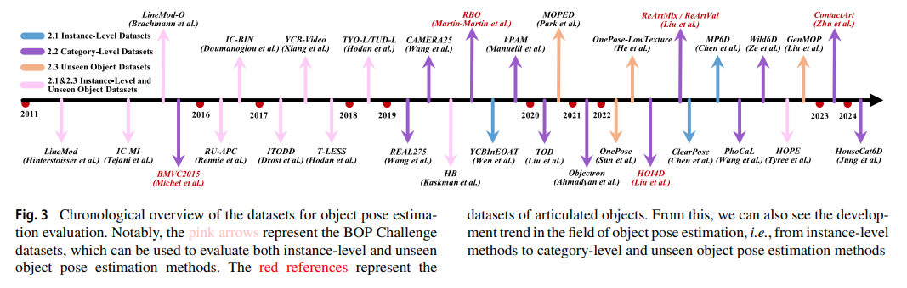

[(출처)](https://ojs.aaai.org/index.php/AAAI/article/view/33123/35278) : Jian Liu and Wei Sun et al., "Deep Learning-Based Object Pose Estimation: A Comprehensive Survey"

### 3-1. 데이터셋 (Instance-Level 방법론)

**Instance-Level 방법론** 에 대한 벤치마크 데이터셋은 다음과 같다.

* BOP Challenge 데이터셋

| 데이터셋                                    | 주요 특징                      | 기본 구성                                         | 
|-----------------------------------------|----------------------------|-----------------------------------------------|
| Linemod Dataset (LM) (2012)             | 복잡한 장면, 질감 없는 물체, 조명 조건 다양 | annotation 된 RGBD 이미지로 구성된 15개의 RGBD sequence |
| Linemod Occlusion Dataset (LM-O) (2014) | 물체가 가려지는 시나리오              | 1214 개의 RGBD 이미지                              | | | |
| T-Less Dataset (2017)                   | 다양한 해상도의 이미지, 질감 없는 물체     | 명확한 질감이 없는 30개의 전자 제품 이미지                     |
| HOPE Dataset (2022)                     | 생활용품 분야 최적화                | HOPE-Image 데이터셋은 50장면으로 구성 (각 장면은 최대 5가지의 밝기) |

* 그 외 데이터셋

| 데이터셋                     | 주요 특징                  | 기본 구성                                                             | 
|--------------------------|------------------------|-------------------------------------------------------------------|
| ClearPose Dataset (2022) | 일상에서 자주 사용되는 투명한 물체 중심 | - 35만 개의 실제 RGBD 이미지 - 500만 개의 instance annotation (63개의 생활용품) |
| MP6D Dataset (2022)      | 금속 제품 중심               | 20,100개의 실제 이미지 (object pose label 포함) + 50,000개의 합성 이미지          |

### 3-2. 데이터셋 (Category-Level 방법론)

**Category-Level 방법론** 에 대한 벤치마크 데이터셋은 다음과 같다.

* Rigid Objects Dataset

| 데이터셋              | 주요 특징                           | 기본 구성                                                      |
|-------------------|---------------------------------|------------------------------------------------------------|
| CAMERA25 (2019)   | ShapeNet dataset (합성 데이터) 가 원본임 | - 1085개의 객체 (instance) - 6개의 물체 분류                      |
| REAL275 (2019)    | 학문 연구 데이터셋으로 활용됨                | - 18개의 동영상 (학습 7개, 검증 5개, 테스트 6개) - 6개 카테고리의 42개의 객체 포함 |
| HouseCat6D (2024) | 멀티모달 pose estimation 에 사용       | - 194개의 고품질 3D 모델 포함 - 다양한 viewpoint의 41개의 장면           |

* Articulated Objects Dataset

| 데이터셋                 | 주요 특징                                 | 기본 구성                                                       |
|----------------------|---------------------------------------|-------------------------------------------------------------|
| BMVC Dataset (2015)  | -                                     | - 노트북, 캐비닛, 컵보드, 장난감 기차의 4가지 object - CAD 모델 및 관련 텍스트 파일 |
| HOI4D Dataset (2022) | 인간-물체 상호작용 관련 연구 데이터셋                 | - 240만 개의 RGBD 비디오 프레임 - 800개의 object                    |
| ContactArt (2024)    | 정밀한 pose annotation을 위해 스마트폰 및 노트북 사용 | - 노트북, 쓰레기통 등 5가지 object - 총 80개의 instance               |

### 3-3. 데이터셋 (Unseen Object)

**Unseen Object 방법론** 에 대한 벤치마크 데이터셋은 다음과 같다.

| 데이터셋                      | 주요 특징                          | 기본 구성                                                                    |
|---------------------------|--------------------------------|--------------------------------------------------------------------------|
| MOPED Dataset (2020)      | -                              | - 11개의 생활용품에 대한 데이터 - reference image, test image                     |
| GenMOP Dataset (2022)     | -                              | - 10개의 object (flat object, thin object 위주) - 각 object에 대해 2개의 비디오 포함 |
| OnePose Dataset (2022)    | 학습, 검증 set으로 랜덤하게 분할됨          | 150개의 object에 대한 450개의 비디오 시퀀스 (다양한 배경 조건, 모든 각도)                        |
| OnePose-LowTexture (2022) | OnePose 데이터셋의 테스트셋에 대한 보충 데이터셋 | 40개의 생활용품 데이터셋 - 각 object에 대해 2개의 비디오 시퀀스 포함                          |

### 3-4. 평가 메트릭

* Pose Estimation 에 사용되는 metric 들은 다음과 같다.

| 3DoF                  | 6DoF                  | 9DoF                         |
|-----------------------|-----------------------|------------------------------|
| 3개의 회전축 (x, y, z축) 기준 | 3개의 회전축 + **위치 (이동)** | 3개의 회전축 + 위치(이동) + **추가 3축** |

**1. 3DoF (3축 자유도) metric**

* 정확도 평가 기준

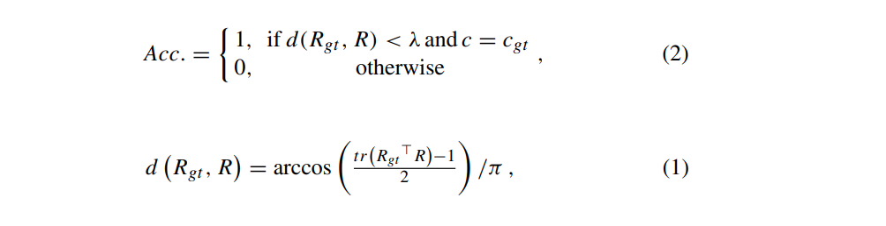

[(출처)](https://ojs.aaai.org/index.php/AAAI/article/view/33123/35278) : Jian Liu and Wei Sun et al., "Deep Learning-Based Object Pose Estimation: A Comprehensive Survey"

| notation       | 설명                                                                |
|----------------|-------------------------------------------------------------------|
| $d(R_{gt}, R)$ | 비교 대상 3D 회전 $R$, $R_{gt}$ 간의 **relative deviation = angle error** |
| $tr$           | 행렬의 주대각선 성분의 합                                                    |
| $R$            | 예측된 3D 회전                                                         |
| $R_{gt}$       | ground-truth 3D 회전                                                |
| $c$            | 예측된 class                                                         |
| $c_{gt}$       | ground-truth class                                                |
| $\lambda$      | 사전 정의된 threshold                                                  |

**2. 6DoF (6축 자유도) metric**

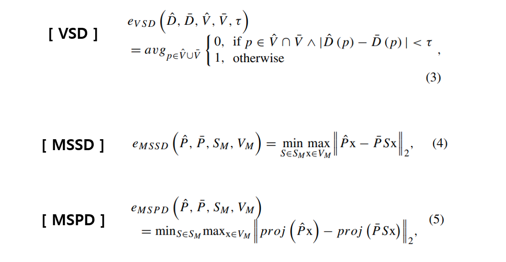

[(출처)](https://ojs.aaai.org/index.php/AAAI/article/view/33123/35278) : Jian Liu and Wei Sun et al., "Deep Learning-Based Object Pose Estimation: A Comprehensive Survey"

* distance map $D$ 와 픽셀 $p$ 에 대해, $D(p)$ 는 **카메라 중심과 3D point $x_p$ 사이의 거리** 를 저장한다.

| notation                       | 설명                                                                                                     |
|--------------------------------|--------------------------------------------------------------------------------------------------------|
| $\hat{P}$, $\bar{P}$           | 각각 **estimated** pose, **ground-truth** pose                                                           |
| $\hat{D}$, $\bar{D}$           | object model $M$ 에 의해 생성된 distance map (서로 다른 2개의 pose $\hat{P}$, $\bar{P}$ 기준)                        |
| $\hat{V}$, $\bar{V}$           | distance map $\hat{D}$, $\bar{D}$ 와, test image $I$ 에 대한 distance map $D_I$ 를 비교하여 생성된 Visibility Mask |
| $\tau$                         | mis-alignment tolerance                                                                                |
| $S_M$                          | object model $M$ 에 대한 global 대칭 변환                                                                     |
| $V_M$                          | object model $M$ 의 vertex                                                                              |
| $proj$                         | pixel-level 2D projection                                                                              |
| $\|\hat{D} - \bar{D}\| < \tau$ | estimated, groud-truth pose 간 **distance 의 차이가 $\tau$ 미만** 임을 의미                                       |

* **비대칭 물체/대칭 물체** 에 대한 metric으로 다음과 같은 것이 있다.

| metric                                 | 설명                                                         | 적용 대상      |
|----------------------------------------|------------------------------------------------------------|------------|
| ADD (average point distance)           | 3D model point $x \in O$ 에 대해, **평균 pairwise distance** 계산 | **비대칭** 물체 |
| ADD-S (average closest point distance) | 평균 거리를 **nearest point distance** 형태로 계산                   | **대칭** 물체  |

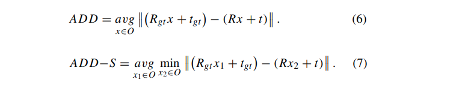

[(출처)](https://ojs.aaai.org/index.php/AAAI/article/view/33123/35278) : Jian Liu and Wei Sun et al., "Deep Learning-Based Object Pose Estimation: A Comprehensive Survey"

| notation           | 설명                                                      |
|--------------------|---------------------------------------------------------|
| $R_{gt}$, $t_{gt}$ | **ground truth rotation**, ground truth **translation** |
| $R$, $t$           | **estimated** rotation, estimated translation           |

* 예측된 3D rotation, translation에 대한 **오류를 직접 정량화** 하기 위한, $n^omcm$ metric

[(출처)](https://ojs.aaai.org/index.php/AAAI/article/view/33123/35278) : Jian Liu and Wei Sun et al., "Deep Learning-Based Object Pose Estimation: A Comprehensive Survey"

| notation | 설명                |
|----------|-------------------|
| $e_R$    | rotation error    |
| $e_t$    | translation error |

**3. 9DoF (9축 자유도) metric**

* 9DoF metric 으로는 $IoU_{3D}$ (IoU 컨셉) 를 사용한다.
* 즉, **ground-truth, predicted 3D bounding box 간의 IoU 값** 을 metric으로 사용한다.

$\displaystyle IoU_{3D} = \frac{P_B \cap G_B}{P_B \cup G_B}$

| notation | 설명                               |
|----------|----------------------------------|
| $G_B$    | **ground-truth** 3D bounding box |
| $P_B$    | **predicted** 3D bounding box    |

## 4. Instance-Level Pose Estimation

**Instance-Level Pose Estimation (객체 단위)** 에 사용되는 방법론은 다음과 같다.

| 방법론 분류                                                           | 방법론 설명                                                  |
|------------------------------------------------------------------|---------------------------------------------------------|
| [4-1. Correspondence (일치) 기반 방법론](#4-1-correspondence-일치-기반-방법론) | **Sparse, Dense** correspondence 방법론으로 구분               |
| [4-2. 템플릿 기반 방법론](#4-2-템플릿-기반-방법론)                               | 이미지의 **전역 정보를 이용** 함으로써, **질감이 없는 object** 를 잘 처리할 수 있음 |
| [4-3. Voting (투표) 기반 방법론](#4-3-voting-투표-기반-방법론)                 | **pixel-level 또는 point-level 의 voting** 기반 방법론          |
| [4-4. Regression (회귀) 기반 방법론](#4-4-regression-회귀-기반-방법론)         | **학습된 feature** 로부터 object pose 를 얻는 것을 목표로 함           |

### 4-1. Correspondence (일치) 기반 방법론

* Correspondence 기반 방법론은 **Sparse, Dense correspondence 로 구분** 된다.

| 구분                    | 설명                                                                                                       |
|-----------------------|----------------------------------------------------------------------------------------------------------|
| Sparse correspondence | 입력 이미지 또는 point cloud 에서 **object keypoint 를 탐지** 하여, 입력 이미지와 object model 간 **2D-3D, 3D-3D 로 일치** 하도록 함 |
| Dense correspondence  | **Sparse correspondence 기반 방법론보다 훨씬 많은 수의 correspondence** 를 이용하여, **dense 2D-3D, 3D-3D 일치** 를 생성하도록 함   |

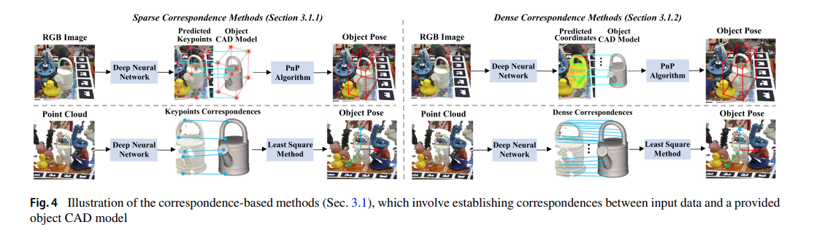

[(출처)](https://ojs.aaai.org/index.php/AAAI/article/view/33123/35278) : Jian Liu and Wei Sun et al., "Deep Learning-Based Object Pose Estimation: A Comprehensive Survey"

### 4-2. 템플릿 기반 방법론

* 템플릿 (Template) 기반 방법론은 **이미지의 전역 정보를 이용하여 질감이 없는 object를 처리(인식)** 하기 위한 것이다.
  * ground-truth object pose로 명시된 **수많은 템플릿 중 대상 물체와 가장 유사한 템플릿** 을 찾는 방법을 사용한다.

| 구분                                    | 설명                                                                                 |
|---------------------------------------|------------------------------------------------------------------------------------|
| **RGB-Based** Template Method         | 입력이 **RGB 이미지** 일 때, **pose estimation 을 이미지 추출 task 로 재구성** 하는 방법                 |
| **Point Cloud-Based** Template Method | 입력이 **point cloud** 인 경우 사용 (관측된 point cloud에 가장 가까운 **최적의 relative pose**를 찾는 방식) |

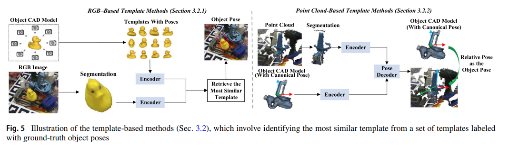

[(출처)](https://ojs.aaai.org/index.php/AAAI/article/view/33123/35278) : Jian Liu and Wei Sun et al., "Deep Learning-Based Object Pose Estimation: A Comprehensive Survey"

### 4-3. Voting (투표) 기반 방법론

* Voting (투표) 기반 방법론은 **pixel-level 또는 point-level voting 을 이용하여 object pose를 탐지** 하는 것이다.
  * 방법론은 **indirect voting** 과 **direct voting** 으로 구분한다.

| 구분                  | 설명                                                                                                                                                                                              |
|---------------------|-------------------------------------------------------------------------------------------------------------------------------------------------------------------------------------------------|
| **indirect** voting | 다음 2가지 방법 중 하나를 사용하여, **2D-3D 또는 3D-3D keypoint correspondence** 를 이용하여 object pose 도출  - **pixel-level** voting 으로 **2D** keypoint 를 측정 - **point-level** voting 으로 **3D** keypoint 를 측정 |
| **direct** voting   | pixel-level 또는 point-level voting 으로부터 **pose, confidence를 직접 예측** - indirect voting이 **keypoint 선택에 결과가 크게 좌우되는 것을 보충** 하기 위함                                                               |

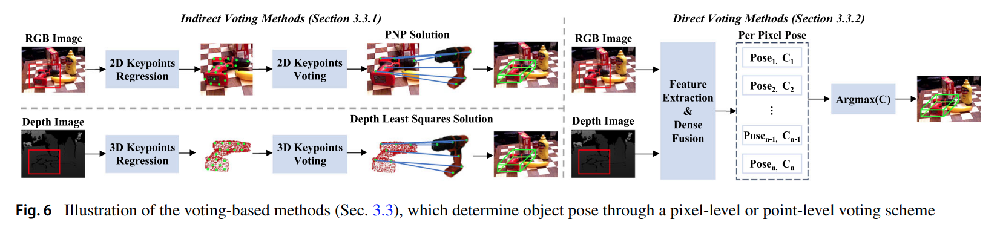

[(출처)](https://ojs.aaai.org/index.php/AAAI/article/view/33123/35278) : Jian Liu and Wei Sun et al., "Deep Learning-Based Object Pose Estimation: A Comprehensive Survey"

### 4-4. Regression (회귀) 기반 방법론

* Regression (회귀) 기반 방법론은 **학습된 feature로부터 object pose를 직접 얻는** 방식을 사용한다. 

| 구분                         | 설명                                                                       |
|----------------------------|--------------------------------------------------------------------------|
| Geometry-guided regression | RGBD 이미지에서의 **기하학적 정보** (3D 구조적 특징 또는 2D-3D 기하학적 특징) 를 추출하여 이용           |
| Direct regression          | 추가적인 변환 step 없이, **RGBD 이미지에서 object pose를 직접 복원** - 이로 인해 **복잡도 감소** |

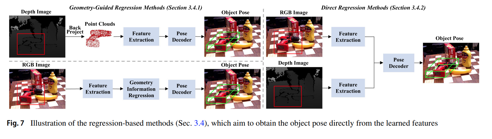

[(출처)](https://ojs.aaai.org/index.php/AAAI/article/view/33123/35278) : Jian Liu and Wei Sun et al., "Deep Learning-Based Object Pose Estimation: A Comprehensive Survey"

## 5. Category-Level Pose Estimation

**Category-Level Pose Estimation** 은 다음과 같은 2가지 방법론으로 구분된다.

| 방법론 분류                       | 설명                                                                                                                                                                                                                                                                                          |
|------------------------------|---------------------------------------------------------------------------------------------------------------------------------------------------------------------------------------------------------------------------------------------------------------------------------------------|
| Shape Prior-**Based** Method | 각 class 별 object에 대한 CAD 모델을 딥러닝으로 학습시킨 후, 이 정보들을 **3D 기하학 정보** 로 사용한다. - 이 3D 기하학 정보는 **해당 class의 unseen object pose estimation** 에 사용한다.  다음과 같은 2가지 방법론이 존재한다. - 1. **Normalized Object** Coordinate Space (NOCS) shape alignment - 2. **Direct** pose regression methods |
| Shape Prior-**Free** Method  | shape prior 를 이용하지 않는 방법으로, **일반화 성능이 비교적 높다.**  다음과 같은 3가지 방법론이 존재한다. - 1. **depth**-guided **geometry**-aware - 2. **RGBD**-guided **semantic and geometry** fusion - 3. 그 외 방법                                                                                            |

* Shape Prior-**Based** Method 개요

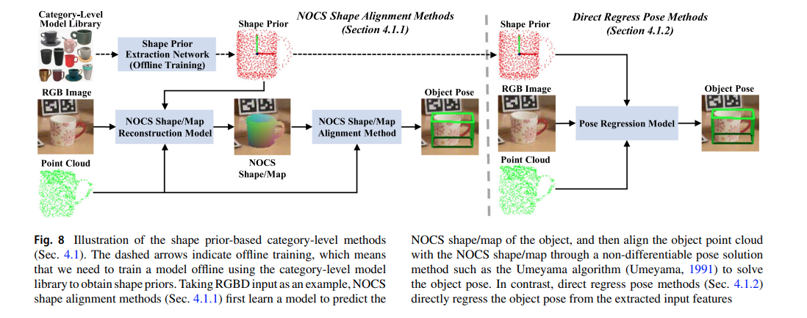

[(출처)](https://ojs.aaai.org/index.php/AAAI/article/view/33123/35278) : Jian Liu and Wei Sun et al., "Deep Learning-Based Object Pose Estimation: A Comprehensive Survey"

* Shape Prior-**Free** Method 개요

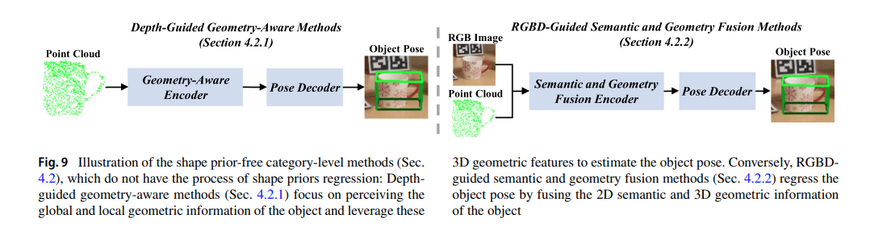

[(출처)](https://ojs.aaai.org/index.php/AAAI/article/view/33123/35278) : Jian Liu and Wei Sun et al., "Deep Learning-Based Object Pose Estimation: A Comprehensive Survey"

## 6. Unseen Object Pose Estimation

**Unseen Object Pose Estimation** 은 다음과 같은 2가지 방법론으로 구분된다.

| 방법론 분류                                  | 설명                                                                                                                                                                                   |
|-----------------------------------------|--------------------------------------------------------------------------------------------------------------------------------------------------------------------------------------|
| **CAD Model**-Based Method              | **object CAD 모델을 사전 지식** 으로 활용하여, 새로운 object에 대한 pose estimation 실시  다음과 같은 2가지 방법론이 있음 - 1. **Feature Matching**-Based Methods - 2. **Template Matching**-Based Methods |
| **Manual Reference View**-Based Methods | unseen object에 대한 **CAD 모델을 필요로 하지 않는** 방법으로, target object에 대한 **사람이 라벨링한 reference view** 필요 - CAD Model-Based 와 마찬가지로, Feature/Template Matching-Based Method 로 구분             |

* **CAD Model**-Based Method 개요

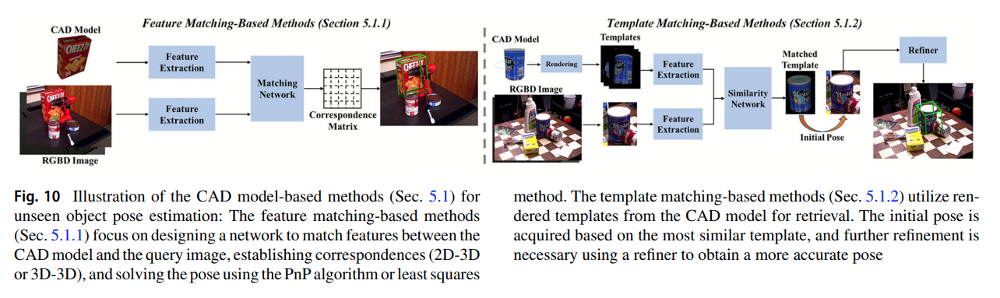

[(출처)](https://ojs.aaai.org/index.php/AAAI/article/view/33123/35278) : Jian Liu and Wei Sun et al., "Deep Learning-Based Object Pose Estimation: A Comprehensive Survey"

* **Manual Reference View**-Based Method 개요

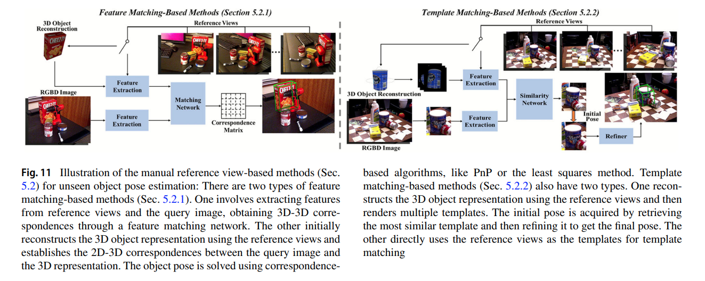

[(출처)](https://ojs.aaai.org/index.php/AAAI/article/view/33123/35278) : Jian Liu and Wei Sun et al., "Deep Learning-Based Object Pose Estimation: A Comprehensive Survey"

## 7. Pose Estimation의 응용

Pose Estimation의 응용 분야는 다음과 같다.

| 응용 분야                       | 세부 분야                                                      |
|-----------------------------|------------------------------------------------------------|
| 로보틱스 (Robotic Manipulation) | Instance-Level, Category-Level, Unseen Object Manipulation |
| AR (증강현실), VR (가상현실)        | -                                                          |
| 우주항공 분야                     | -                                                          |
| 기타                          | 손과 물체 간 상호작용, 자율주행 자동차 등                                   |
